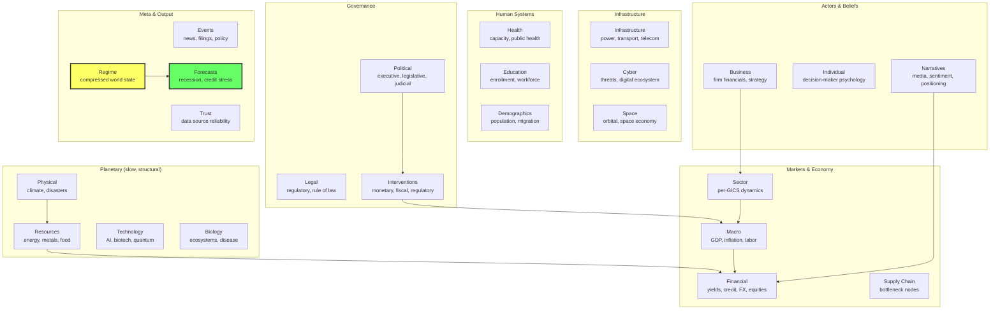
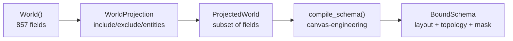

# Architecture

## Schema overview

The world model schema is a nested dataclass hierarchy with **19 layers and 857 fields**. Each field is a `canvas_engineering.Field` with declared temporal frequency, loss weight, and semantic type. Fields are arranged on a `(T, H, W)` canvas grid where the topology defines which positions attend to each other.



## Temporal frequency classes

Eight frequency classes span sub-minute to multi-year. Each field's `period` determines how often it updates on the canvas:

| Class | Period (ticks) | Real-world cadence | Example fields |
|-------|----------------|-------------------|----------------|
| **tau0** | 1 | Sub-minute | market prices, breaking news |
| **tau1** | 4 | Hourly | grid load, intraday commodities |
| **tau2** | 16 | Daily | commodity closes, port congestion |
| **tau3** | 48 | Weekly | jobless claims, inventories |
| **tau4** | 192 | Monthly | CPI, PMI, housing starts |
| **tau5** | 576 | Quarterly | GDP, earnings, capex |
| **tau6** | 2304 | Annual | demographics, infrastructure |
| **tau7** | 4608 | Multi-year | regime changes, tech diffusion |

Fields held constant within their period -- a monthly CPI field only updates every 192 ticks, even if the canvas runs at tick-level resolution.

## Dynamic entities

Firms, individuals, countries, sectors, and supply chain nodes are created at runtime using `dataclasses.make_dataclass`. This allows projections to include arbitrary named entities without hardcoding them in the schema:

```python
proj = WorldProjection(
    include=["financial", "country_us.macro"],
    firms=["AAPL", "NVDA"],           # creates firm_AAPL, firm_NVDA
    individuals=["ceo_cook"],          # creates person_ceo_cook
    countries=["jp", "uk"],            # creates country_jp, country_uk
    sectors=["semiconductors"],        # creates sector_semiconductors
)
```

Each dynamic entity instantiates a full dataclass (e.g., `Business` has 57 fields for financials, operations, strategy, market position, and risk).

## Projection system

`WorldProjection` declares which parts of the schema to include. `project()` compiles it to a `BoundSchema` with canvas layout and topology:



1. Start with full `World()` instance (857 fields)
2. Walk the dataclass tree, keeping only fields matching `include` paths
3. Create dynamic entity instances for requested firms/individuals/etc.
4. Build a `ProjectedWorld` dataclass containing only the active subtree
5. Call `compile_schema(projected_world, T, H, W, d_model)` to allocate fields on the canvas grid

The result is a `BoundSchema` with:

- `field_names` -- flat list of dotted field paths on the canvas
- `layout` -- `CanvasLayout` with grid positions for each field
- `topology` -- `CanvasTopology` with attention connections
- `build_semantic_conditioner()` -- produces conditioning from field descriptions

### Auto-sizing

When `H=None, W=None`, `compile_schema` auto-computes the canvas size from the number of fields:

```python
bound = project(proj, T=1, d_model=64)  # H, W auto-sized
```

## Canvas-engineering integration

This library depends on [canvas-engineering](https://github.com/JacobFV/canvas-engineering) for the compute substrate:

| Component | Role |
|-----------|------|
| `Field` | Typed unit with `period`, `loss_weight`, `semantic_tag` |
| `compile_schema` | Packs Fields onto `(T, H, W)` grid |
| `ConnectivityPolicy` | Controls intra- vs cross-domain attention |
| `BoundSchema` | Compiled output: layout + topology + masks |
| `CanvasTopology` | Declarative block-to-block attention graph |
| `SemanticConditioner` | Conditions canvas positions on field descriptions |

The schema defines **what** the world model knows. Canvas-engineering defines **how** it computes over that knowledge. The topology IS the compute graph.

### Coarse-graining

When a subtree is excluded from a projection, its parent field is still present as a 1x1 coarse-grained Field. This means the model can still learn compressed dynamics for excluded domains:

```
Financial (included fully)
  yield_curves      -> 10 separate fields on canvas
  credit             -> 10 separate fields
Country_US.macro (included)
  output             -> 9 separate fields
Country_US.politics (excluded)
  -> 1 coarse-grained "country_us.politics" field
     still participates in attention, learns compressed dynamics
```
