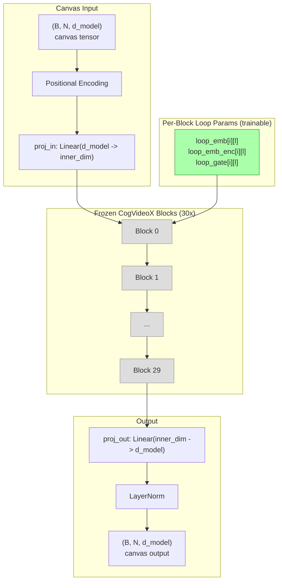

# CogVideoX Backbone

The default training backbone grafts onto a pretrained CogVideoX video diffusion transformer. Instead of training from random initialization, the world model inherits rich spatiotemporal priors from video pretraining and learns only a thin adaptation layer.

## Why video diffusion?

Video diffusion models learn fundamental physics of the visual world -- object permanence, gravity, fluid dynamics, lighting. While the world model operates on structured time series (not video), the attention patterns learned by CogVideoX transfer well:

- **Temporal continuity**: Things change smoothly over time
- **Spatial correlation**: Nearby things are related
- **Multi-scale dynamics**: Fast changes happen on top of slow trends
- **Compositional structure**: The world is made of parts

These priors accelerate training on heterogeneous world data. The model doesn't need to learn temporal attention from scratch -- it already knows how sequences evolve.

## Architecture



### How it works

1. **Project up**: Canvas tensor `(B, N, d_model)` is projected to CogVideoX's `inner_dim` (e.g., 3072 for CogVideoX-2b)
2. **Loop through frozen blocks**: Each pretrained block runs L times per forward pass. Each iteration adds a zero-initialized loop embedding and applies a sigmoid-gated residual
3. **Encoder conditioning**: A single learned token participates in CogVideoX's joint attention as global context
4. **Project down**: Output is projected back to `d_model` for the canvas loss

### Zero-init safety

All loop embeddings and gates start at zero. At initialization:

- `loop_emb = 0` means no perturbation to hidden states
- `loop_gate = sigmoid(0) = 0.5` means 50% blend of block output and input
- The backbone behaves like a standard (frozen) transformer pass-through

Training gradually activates the loop parameters, teaching the model domain-specific reasoning patterns on top of the pretrained video priors.

## Parameter budget

| Component | Params | Trainable? |
|-----------|--------|-----------|
| CogVideoX frozen blocks (30) | ~3.3B | No |
| Loop embeddings (30 blocks x 3 loops x inner_dim) | ~553K | Yes |
| Loop gates (30 blocks x 3 loops) | ~90 | Yes |
| Encoder conditioning token | ~3K | Yes |
| proj_in (d_model -> inner_dim) | ~400K | Yes |
| proj_out (inner_dim -> d_model) | ~400K | Yes |
| **Total trainable** | **~1.35M** | |

Only **0.04%** of parameters are trainable. The rest provide frozen spatiotemporal priors.

## Usage

### Default (CogVideoX grafting)

```python
from general_unified_world_model import DAGCurriculumTrainer

trainer = DAGCurriculumTrainer(
    nodes=dag,
    data_sources=data_sources,
    backbone="cogvideox",                     # default
    pretrained_model_id="THUDM/CogVideoX-2b",  # default
    device="cuda",
)
trainer.run()
```

### Fallback (from scratch)

```python
trainer = DAGCurriculumTrainer(
    nodes=dag,
    data_sources=data_sources,
    backbone="scratch",   # train from random init
    device="cuda",
)
```

### CLI

```bash
# CogVideoX (default)
python scripts/train_h100.py

# From scratch
python scripts/train_h100.py --backbone scratch
```

## Installation

CogVideoX requires the `diffusers` library:

```bash
pip install "general-unified-world-model[cogvideox]"
```

The pretrained model (~5GB) is downloaded from HuggingFace on first use and cached in `~/.cache/huggingface/hub/`.

If `diffusers` is not installed, the trainer automatically falls back to the scratch backbone.

## Mixed precision

CogVideoX blocks run in bfloat16 (loaded with `torch_dtype=torch.bfloat16`). Trainable parameters (loop embeddings, projections) stay in float32 for stable gradients. The backbone handles dtype conversion at the block boundary automatically.

## Weight merging

When the DAG curriculum merges parent weights at join nodes, only trainable parameters are averaged. The frozen CogVideoX blocks are shared across all nodes (loaded once, kept on GPU throughout training). This means:

- Checkpoint files are small (~5MB instead of ~6GB)
- Memory usage is constant regardless of how many nodes have been trained
- Merging is fast (only ~1.35M parameters to average)
