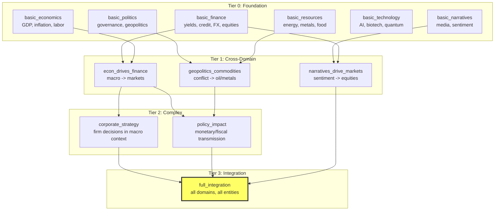

# DAG Curriculum Training

The training curriculum is a directed acyclic graph (DAG) where fork nodes train domain specialists in parallel and join nodes merge them by weight averaging.

## Why a DAG?

Training the full 857-field world model from scratch on a single canvas is impractical -- the loss surface is too complex. The DAG curriculum decomposes the problem:

1. **Foundation**: Train domain specialists on small, focused canvases
2. **Cross-domain**: Merge specialists and train on paired domains
3. **Complex**: Add dynamic entities and second-order effects
4. **Integration**: All domains on one canvas



## Standard DAG (12 nodes)

| Node | Tier | Fields | Data Sources | Steps |
|------|------|--------|-------------|-------|
| `basic_finance` | 0 | `financial.*` | Yahoo Finance, FRED rates | 10,000 |
| `basic_economics` | 0 | `country_*.macro` | FRED macro | 10,000 |
| `basic_politics` | 0 | `country_*.politics` | (none yet) | 10,000 |
| `basic_resources` | 0 | `resources.*` | Yahoo commodities | 10,000 |
| `basic_technology` | 0 | `technology.*` | (none yet) | 10,000 |
| `basic_narratives` | 0 | `narratives.*, events.*` | News embeddings | 10,000 |
| `econ_drives_finance` | 1 | financial + macro + regime | Yahoo + FRED | 15,000 |
| `geopolitics_commodities` | 1 | resources + politics + events | Yahoo commodities | 15,000 |
| `narratives_drive_markets` | 1 | narratives + equities + credit | Yahoo + news | 15,000 |
| `corporate_strategy` | 2 | equities + macro + firms | Yahoo + FRED | 20,000 |
| `policy_impact` | 2 | countries + financial + interventions | FRED + Yahoo | 20,000 |
| `full_integration` | 3 | `*` (everything) | All sources | 30,000 |

**Total**: ~175,000 training steps across 12 nodes.

## Weight merging at joins

When a child node has multiple parents, their backbone weights are averaged element-wise (model souping). This works because:

- **Semantic conditioning** means field identity comes from embeddings, not hardcoded heads
- Zero-initialized loop parameters mean the model starts close to the merged average
- The child node then fine-tunes on the broader domain

```python
# Merge logic (simplified)
for key in target_state_dict:
    matching = [parent_sd[key] for parent in parents
                if key in parent_sd and shapes_match]
    merged[key] = torch.stack(matching).mean(dim=0)
```

## H100 hyperparameters

The `scripts/train_h100.py` script configures hyperparameters for NVIDIA H100 80GB:

| Tier | d_model | n_layers | batch_size | lr | loops |
|------|---------|----------|------------|-----|-------|
| 0 | 128 | 6 | 64 | 2e-4 | 3 |
| 1 | 128 | 8 | 48 | 1e-4 | 3 |
| 2 | 128 | 10 | 32 | 5e-5 | 3 |
| 3 | 128 | 12 | 24 | 3e-5 | 3 |

With CogVideoX backbone, `n_layers` is determined by the pretrained model (30 blocks for CogVideoX-2b). Only `d_model` (canvas dimension), `batch_size`, and `lr` are relevant.

## YAML curriculum spec

Curricula can be defined in YAML for reproducibility:

```yaml
name: standard_curriculum
defaults:
  d_model: 64
  n_layers: 6
  n_loops: 3
  n_steps: 5000
plan:
  - name: foundations
    stages:
      - description: "Financial markets: yields, credit, equities, FX"
        include: ["financial"]
        datasets: ["yahoo_finance", "fred_rates"]
      - description: "Macroeconomic fundamentals: GDP, inflation, labor"
        include: ["country_us.macro"]
        datasets: ["fred_macro"]
  - name: cross_domain
    builds_on: foundations
    stages:
      - description: "How macro drives financial markets"
        include: ["financial", "country_us.macro", "regime"]
        datasets: ["yahoo_finance", "fred_macro", "fred_rates"]
```

## LLM-driven curriculum design

The `build_curriculum()` function uses an LLM to examine available datasets and design an optimal training schedule:

```python
from general_unified_world_model import build_curriculum, DatasetProfile

curriculum = build_curriculum(
    goal="Fine-tune to learn cardiovascular patient health",
    datasets=[
        DatasetProfile(name="Hospital EHR", ...),
        DatasetProfile(name="Insurance Claims", ...),
    ],
)

nodes = curriculum.to_training_nodes()
```
