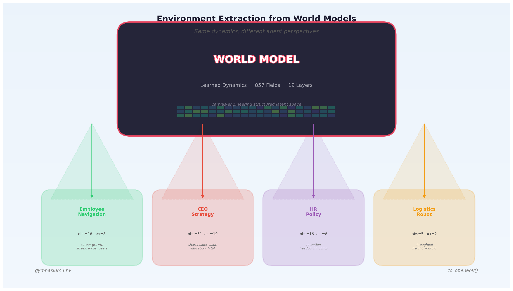
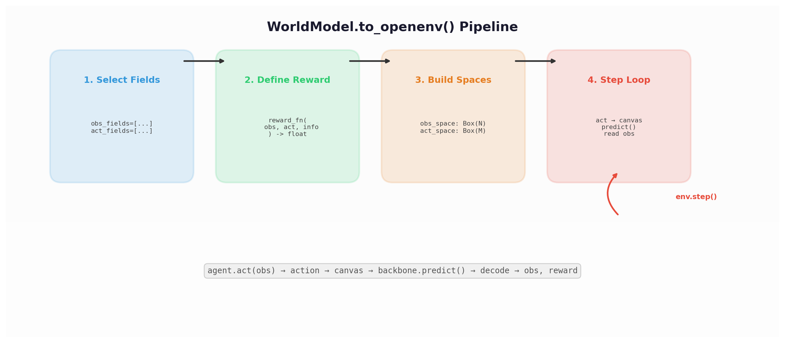
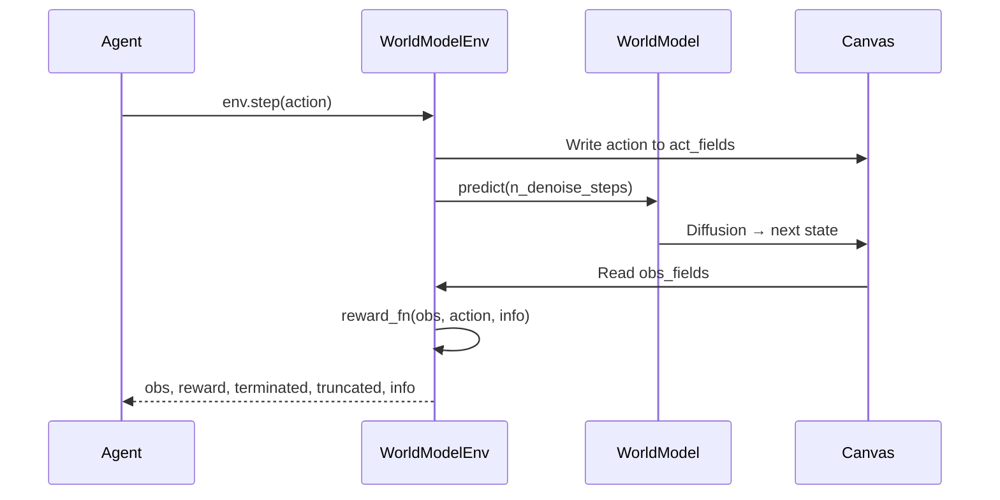
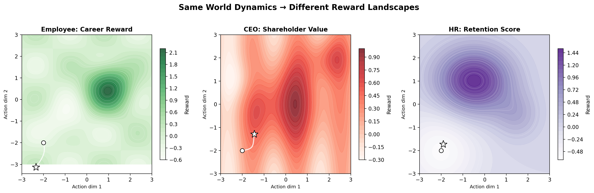
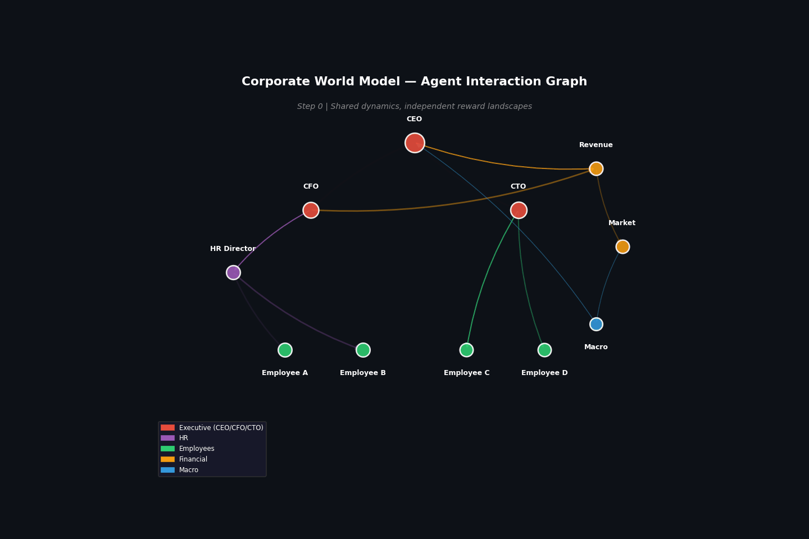
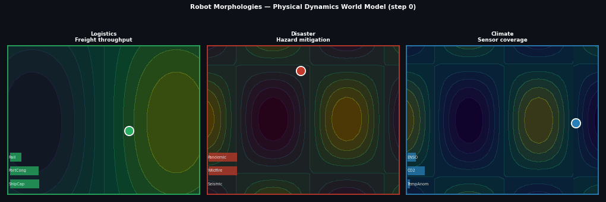
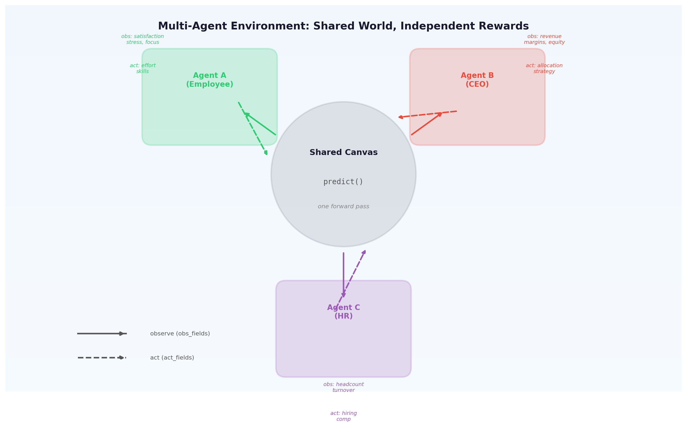
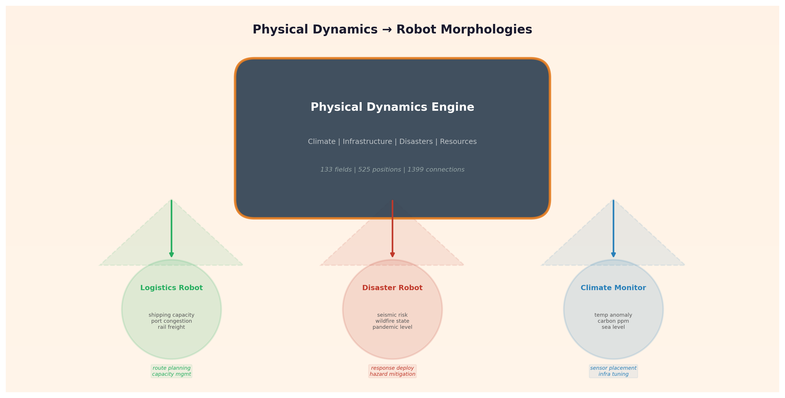

# Environment Extraction

**Extract Gymnasium RL environments from trained world models.**

A trained WorldModel captures dynamics across all its fields. `to_openenv()` carves out agent perspectives — selecting which fields the agent sees, which it controls, and how reward is computed. The same world model yields many different environments, each with its own reward landscape but sharing the same learned dynamics.

<figure markdown>
  { loading=lazy }
  <figcaption>One world model, many environments. Each agent sees and controls different canvas fields, producing different reward landscapes from the same underlying dynamics.</figcaption>
</figure>

## Why this matters

Training a world model is expensive — it requires learning the causal dynamics of hundreds of fields across multiple domains. But once trained, that dynamics model becomes a **reusable simulator**. You can:

- **Distill dynamics into agents**: Train different RL agents for different roles (employee, CEO, HR director) in the same corporate world
- **Vary morphology**: Give different robots different sensors and actuators over the same physical dynamics
- **Multi-agent training**: All agents share one `predict()` call — their actions jointly shape the next state
- **Transfer learning**: An agent trained in one perspective can be evaluated in another

## Quick start

```python
from general_unified_world_model import GeneralUnifiedWorldModel

# 1. Build and train a world model
model = GeneralUnifiedWorldModel(
    include=["financial", "regime", "sector_tech"],
    entities={"firm_acme": Business()},
)
model.finetune(my_data, n_steps=5000)

# 2. Extract an environment
env = model.to_openenv(
    obs_fields=["firm_acme.financials.revenue", "regime.growth_regime"],
    act_fields=["firm_acme.strategy.capital_allocation"],
    reward_fn=lambda obs, act, info: obs["firm_acme.financials.revenue"].mean(),
)

# 3. Standard Gymnasium loop
obs, info = env.reset()
for step in range(100):
    action = my_agent.act(obs)
    obs, reward, terminated, truncated, info = env.step(action)
```

## How it works

<figure markdown>
  { loading=lazy }
  <figcaption>The to_openenv() pipeline: select fields, define reward, build spaces, run the step loop. Each step writes actions to the canvas, runs predict(), and reads observations.</figcaption>
</figure>



At each step:

1. **Actions → Canvas**: Agent's action vector is split into per-field values and encoded onto the canvas at `act_fields` positions
2. **Predict**: The world model runs diffusion inference, advancing the entire canvas state forward
3. **Canvas → Observations**: The agent's `obs_fields` are decoded from the predicted canvas
4. **Reward**: The `reward_fn` scores the new observation

## Same dynamics, different rewards

<figure markdown>
  { loading=lazy }
  <figcaption>Three different reward landscapes extracted from the same world dynamics. The white path shows gradient ascent from the start (circle) to optimum (star). Each agent experiences a fundamentally different optimization problem.</figcaption>
</figure>

The key insight: **the same dynamics produce different reward landscapes depending on which fields you observe and how you define success**. An employee navigating a corporation and a CEO managing it experience the same organizational dynamics but face completely different optimization problems.

## API Reference

### `WorldModel.to_openenv()`

```python
env = model.to_openenv(
    obs_fields=["field.path.a", "field.path.b"],
    act_fields=["field.path.c"],
    reward_fn=my_reward_fn,
    terminated_fn=None,         # Optional: (obs_dict, step, info) -> bool
    max_steps=200,              # Truncation limit
    n_denoise_steps=10,         # Speed vs quality tradeoff
    act_low=-1.0,               # Action space bounds
    act_high=1.0,
    initial_obs_fn=None,        # Set initial canvas state on reset
    render_mode=None,           # "human" or "rgb_array"
)
```

| Parameter | Type | Description |
|-----------|------|-------------|
| `obs_fields` | `list[str]` | Field paths the agent observes |
| `act_fields` | `list[str]` | Field paths the agent controls |
| `reward_fn` | `Callable` | `(obs_dict, action, info) -> float` |
| `terminated_fn` | `Callable \| None` | `(obs_dict, step, info) -> bool` |
| `max_steps` | `int` | Episode length before truncation |
| `n_denoise_steps` | `int` | Diffusion steps per predict (lower = faster) |
| `act_low`, `act_high` | `float` | Continuous action bounds |
| `initial_obs_fn` | `Callable \| None` | Returns dict of initial observations |
| `render_mode` | `str \| None` | `"human"` (text), `"rgb_array"` (image), or None |

**Returns:** `WorldModelEnv` (a `gymnasium.Env` subclass)

### `WorldModel.to_multi_openenv()`

```python
from general_unified_world_model import AgentSpec

multi = model.to_multi_openenv(
    agents={
        "employee": AgentSpec(
            obs_fields=[...], act_fields=[...], reward_fn=employee_reward,
        ),
        "ceo": AgentSpec(
            obs_fields=[...], act_fields=[...], reward_fn=ceo_reward,
        ),
    },
    max_steps=200,
    n_denoise_steps=10,
)
```

All agents act simultaneously. A single `predict()` advances the shared world. Returns per-agent dicts for observations, rewards, termination, and info.

### `AgentSpec`

| Parameter | Type | Description |
|-----------|------|-------------|
| `obs_fields` | `list[str]` | This agent's observation fields |
| `act_fields` | `list[str]` | This agent's action fields |
| `reward_fn` | `Callable` | This agent's reward function |
| `terminated_fn` | `Callable \| None` | This agent's termination condition |
| `act_low`, `act_high` | `float` | This agent's action bounds |

### `WorldModelEnv`

Standard `gymnasium.Env`:

| Method | Signature | Description |
|--------|-----------|-------------|
| `reset()` | `-> (obs, info)` | Clear canvas, return initial observation |
| `step(action)` | `-> (obs, reward, terminated, truncated, info)` | Execute one step |
| `render()` | `-> None \| ndarray` | Visualize current state |
| `close()` | `-> None` | Clean up |

The `info` dict contains:

- `step`: Current step number
- `obs_dict`: Named observation values (field_path → numpy array)
- `predictions`: All field predictions (not just obs_fields)

## Animations

<figure markdown>
  { loading=lazy }
  <figcaption>Corporate agent interaction graph. Signals flow between CEO, CFO, CTO, HR, employees, financials, and macro. Each pulse represents information propagating through shared canvas dynamics.</figcaption>
</figure>

<figure markdown>
  { loading=lazy }
  <figcaption>Three robot morphologies navigating in the physical world model. Each robot has different sensors and actuators but operates in the same world — the background heatmap shows the evolving physical state.</figcaption>
</figure>

## Example: Corporate multi-agent

<figure markdown>
  { loading=lazy }
  <figcaption>Three agents sharing one world model. Solid arrows = observations, dashed arrows = actions. All three observe and act on different fields but share the same canvas dynamics.</figcaption>
</figure>

Build a corporate world model and extract three agent perspectives:

```python
from general_unified_world_model import GeneralUnifiedWorldModel, AgentSpec
from general_unified_world_model.schema.business import Business
from general_unified_world_model.schema.individual import Individual

# Shared world model
model = GeneralUnifiedWorldModel(
    include=["regime", "financial.equities", "sector_tech"],
    entities={
        "firm_acme": Business(),
        "person_ceo": Individual(),
        "person_employee": Individual(),
    },
)

# Employee: maximize career growth
employee_env = model.to_openenv(
    obs_fields=[
        "firm_acme.operations.employee_satisfaction",
        "person_employee.state.stress",
        "person_employee.state.confidence",
        "person_employee.incentives.career_incentives",
    ],
    act_fields=[
        "person_employee.state.current_focus",
        "person_employee.cognitive.risk_appetite",
    ],
    reward_fn=lambda obs, act, info: (
        obs["person_employee.state.confidence"].mean()
        - 0.5 * obs["person_employee.state.stress"].mean()
    ),
)

# CEO: maximize shareholder value
ceo_env = model.to_openenv(
    obs_fields=[
        "firm_acme.financials.revenue_growth",
        "firm_acme.financials.operating_margin",
        "firm_acme.market.equity_price",
        "firm_acme.latent_health",
        "regime.growth_regime",
    ],
    act_fields=[
        "firm_acme.strategy.capital_allocation",
        "firm_acme.strategy.capex_plan",
    ],
    reward_fn=lambda obs, act, info: (
        obs["firm_acme.financials.revenue_growth"].mean()
        + 0.3 * obs["firm_acme.market.equity_price"].mean()
    ),
)

# Multi-agent: all act simultaneously
multi = model.to_multi_openenv(
    agents={
        "employee": AgentSpec(
            obs_fields=["firm_acme.operations.employee_satisfaction",
                        "person_employee.state.stress"],
            act_fields=["person_employee.state.current_focus"],
            reward_fn=lambda obs, act, info: obs.get(
                "firm_acme.operations.employee_satisfaction", [0])[0],
        ),
        "ceo": AgentSpec(
            obs_fields=["firm_acme.financials.revenue_growth",
                        "firm_acme.market.equity_price"],
            act_fields=["firm_acme.strategy.capital_allocation"],
            reward_fn=lambda obs, act, info: obs.get(
                "firm_acme.financials.revenue_growth", [0])[0],
        ),
    },
)

obs = multi.reset()
actions = {name: multi.action_spaces[name].sample() for name in multi.agents}
obs, rewards, terms, truncs, infos = multi.step(actions)
```

[:octicons-code-16: Full source: examples/08_corporate_envs.py](https://github.com/JacobFV/general-unified-world-modeling/blob/develop/examples/08_corporate_envs.py){ .md-button }

## Example: Robot morphologies

<figure markdown>
  { loading=lazy }
  <figcaption>Three robot morphologies extracted from the same physical dynamics world model. Each robot has different sensors (obs_fields) and actuators (act_fields) but operates in the same physical world.</figcaption>
</figure>

Different robots, same physics:

```python
model = GeneralUnifiedWorldModel(
    include=["physical", "resources", "infrastructure", "regime"],
)

# Logistics robot: freight optimization
logistics_env = model.to_openenv(
    obs_fields=[
        "physical.infrastructure.shipping_lane_capacity",
        "physical.infrastructure.port_congestion",
        "physical.infrastructure.rail_freight_network",
    ],
    act_fields=[
        "physical.infrastructure.shipping_lane_capacity",
    ],
    reward_fn=lambda obs, act, info: (
        obs["physical.infrastructure.shipping_lane_capacity"].mean()
        - 0.8 * obs["physical.infrastructure.port_congestion"].mean()
    ),
)

# Disaster response robot: hazard mitigation
disaster_env = model.to_openenv(
    obs_fields=[
        "physical.disasters.active_disaster_state",
        "physical.disasters.wildfire_state",
        "physical.disasters.pandemic_risk",
    ],
    act_fields=[
        "physical.disasters.active_disaster_state",
    ],
    reward_fn=lambda obs, act, info: -sum(
        abs(v.mean()) for v in obs.values()
    ) + 1.0,
)

# Climate monitor: tracking and coverage
climate_env = model.to_openenv(
    obs_fields=[
        "physical.climate.global_temp_anomaly",
        "physical.climate.carbon_ppm",
    ],
    act_fields=[
        "physical.infrastructure.undersea_cable_topology",
    ],
    reward_fn=lambda obs, act, info: -abs(
        obs["physical.climate.global_temp_anomaly"].mean()
    ),
)
```

[:octicons-code-16: Full source: examples/09_robot_envs.py](https://github.com/JacobFV/general-unified-world-modeling/blob/develop/examples/09_robot_envs.py){ .md-button }

## Installation

```bash
pip install "general-unified-world-model[env]"
```

This adds `gymnasium>=0.29` as a dependency. Compatible with both `gymnasium` and legacy `gym`.

## Design notes

**Why not OpenAI Gym directly?** We use `gymnasium` (the maintained fork). The `WorldModelEnv` is a standard `gymnasium.Env` — it works with any RL framework that supports Gymnasium (Stable Baselines 3, RLlib, CleanRL, TorchRL, etc.).

**Why not OpenEnv server/client?** The naming `.to_openenv()` references the idea from [OpenEnv](https://github.com/meta-pytorch/OpenEnv) of environments as standardized interfaces. Our implementation is a local Gymnasium env (no server needed), but it could be wrapped as an OpenEnv server for distributed training.

**Performance**: `n_denoise_steps` controls the speed-quality tradeoff. For RL training, 3-10 steps is usually sufficient. For evaluation, use 50+.

**Shared state**: Multiple `WorldModelEnv` instances from the same `WorldModel` share the canvas. This is intentional for multi-agent scenarios but means single-agent envs should each get their own world model instance (or call `reset()` between uses).
