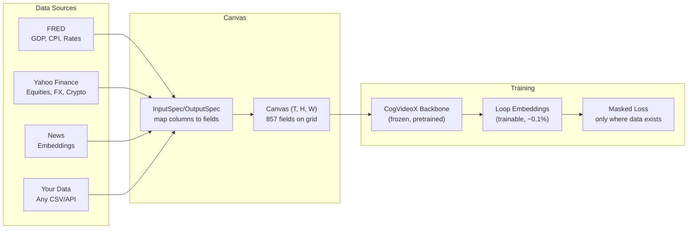

# General Unified World Model

**A typed causal ontology of civilization, built on [canvas-engineering](https://github.com/JacobFV/canvas-engineering) structured latent spaces.**

[](https://pypi.org/project/general-unified-world-model/)
[](https://github.com/JacobFV/general-unified-world-modeling/actions/workflows/ci.yml)
[](https://www.python.org/downloads/)

The General Unified World Model (GUWM) encodes 857 fields across 19 semantic layers into a single structured latent space. It learns from heterogeneous, partial data -- no dataset needs to cover every field. The model discovers cross-domain dynamics (how inflation drives bond yields, how policy shapes commodity markets) through shared latent structure and masked training.

## Install

```bash
pip install general-unified-world-model
```

With data adapters and CogVideoX backbone:

```bash
pip install "general-unified-world-model[data,cogvideox]"
```

## How it works



## 30-second quickstart

```python
from general_unified_world_model import World, WorldProjection, project

# Project to just what you need
proj = WorldProjection(
    include=["financial", "country_us.macro", "regime", "forecasts"],
    firms=["AAPL", "NVDA"],
)
bound = project(proj, T=1, d_model=64)  # auto-sizes canvas

# Train on real data
from general_unified_world_model.data.adapters import yahoo_finance_adapter
yahoo_spec, yahoo_data = yahoo_finance_adapter(start_date="2010-01-01")

# Inference
from general_unified_world_model import WorldModel
model = WorldModel.load("checkpoint.pt", proj)
model.observe("financial.yield_curves.ten_year", 4.25)
predictions = model.predict()
print(predictions["forecasts.macro.recession_prob_3m"])
```

## The 19 layers

| Layer | Fields | Frequency | What it models |
|-------|--------|-----------|----------------|
| Physical | climate, infrastructure, disasters | Annual+ | Planetary boundary conditions |
| Resources | energy, metals, food, water, compute | Hourly--Monthly | Supply/demand/price for commodities |
| Financial | yields, credit, FX, equities, crypto | Sub-minute--Daily | Market prices and risk metrics |
| Country | macro + politics per country | Weekly--Quarterly | GDP, inflation, labor, governance |
| Narratives | media sentiment, positioning | Sub-minute--Monthly | What people believe and how they're positioned |
| Technology | AI, biotech, quantum, robotics | Quarterly+ | Innovation frontier and diffusion |
| Demographics | population, dependency, urbanization | Multi-year | Slow structural shifts |
| Sector | per-GICS sector dynamics | Monthly--Quarterly | Industry supply/demand/margins |
| Firm | financials, operations, strategy | Quarterly | Company-level data |
| Individual | cognitive state, incentives, network | Daily--Quarterly | Decision-maker modeling |
| Events | news, filings, policy announcements | Sub-minute | Discrete happenings |
| Trust | epistemic calibration | Quarterly+ | Data source reliability |
| Regime | compressed global latent | Quarterly+ | World "mode" (growth, crisis, transition) |
| Interventions | monetary, fiscal, regulatory | Monthly+ | Policy actions and their effects |
| Forecasts | recession prob, credit stress, conflict | Output | Predictive output fields |

## Documentation

| Page | Contents |
|------|----------|
| [Architecture](architecture.md) | Schema layers, projection system, canvas integration |
| [Use Cases](use_cases.md) | Practical applications with code |
| [Training Pipeline](training.md) | Heterogeneous data, masked loss, adapters |
| [CogVideoX Backbone](cogvideox.md) | Pretrained video diffusion grafting |
| [DAG Curriculum](dag_curriculum.md) | Fork-join training across domains |
| [Datasets](datasets.md) | Real-world data sources for all 19 layers |
| [API Reference](api.md) | Complete API documentation |
| [Examples](examples.md) | Runnable code snippets |
