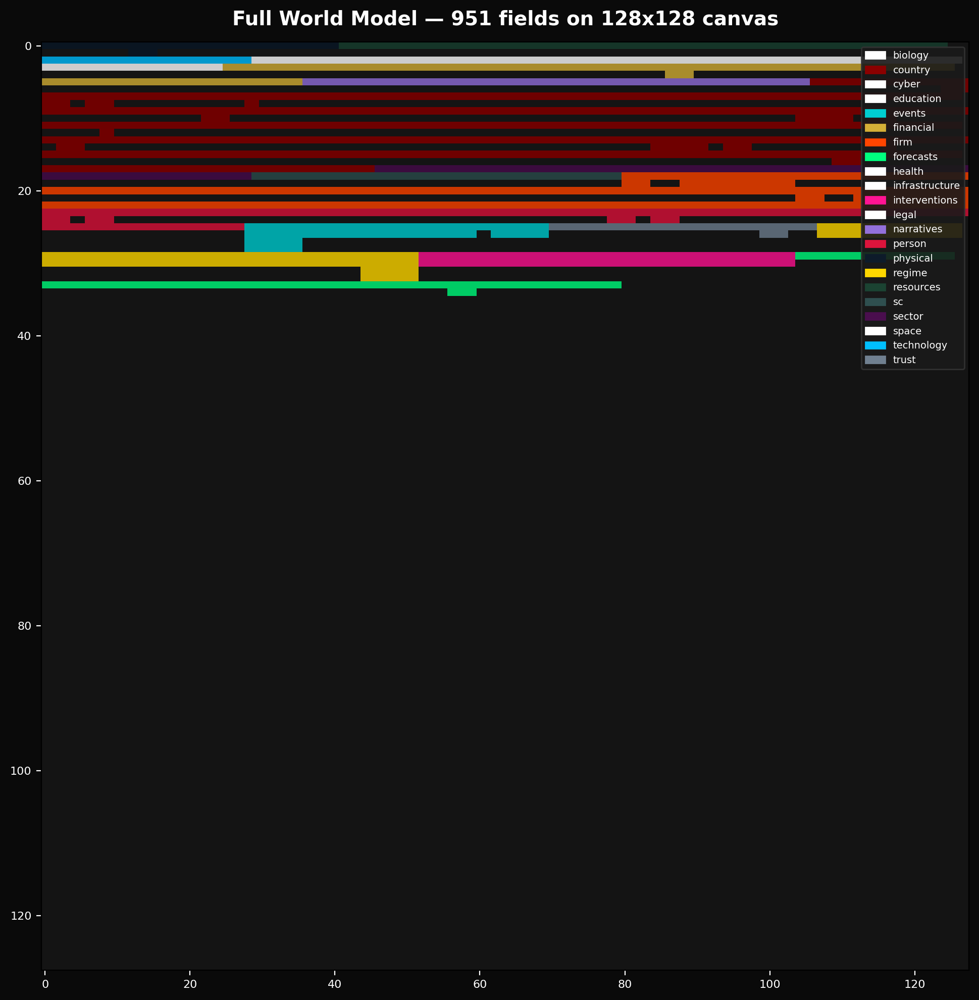
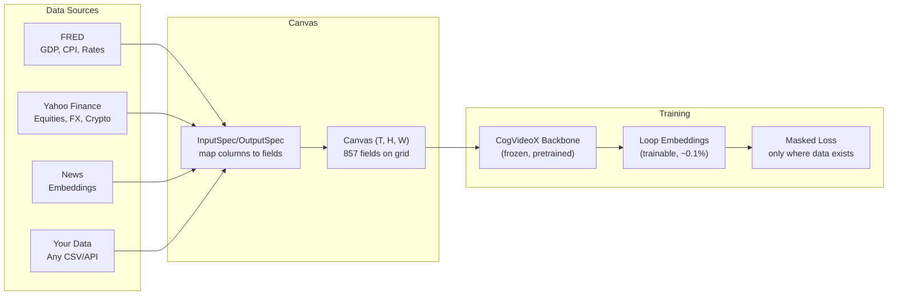
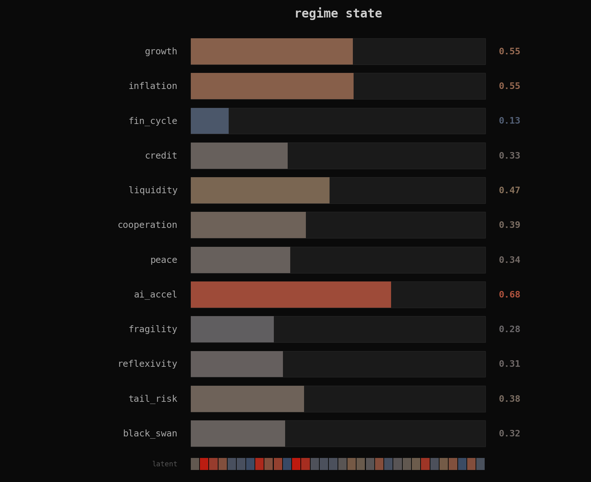

# General Unified World Model

**A typed causal ontology of civilization, built on [canvas-engineering](https://github.com/JacobFV/canvas-engineering) structured latent spaces.**

[](https://pypi.org/project/general-unified-world-model/)
[](https://github.com/JacobFV/general-unified-world-modeling/actions/workflows/ci.yml)
[](https://www.python.org/downloads/)

The General Unified World Model (GUWM) encodes **857 fields** across **19 semantic layers** into a single structured latent space. It learns from heterogeneous, partial data -- no dataset needs to cover every field. The model discovers cross-domain dynamics (how inflation drives bond yields, how policy shapes commodity markets) through shared latent structure and masked training.

<figure markdown>
  { loading=lazy }
  <figcaption>All 857 fields packed onto a 128x128 canvas. Color = domain layer. Each pixel is a latent position with its own semantic identity.</figcaption>
</figure>

## Install

```bash
pip install general-unified-world-model
```

With data adapters and CogVideoX backbone:

```bash
pip install "general-unified-world-model[data,cogvideox]"
```

## How it works



## 30-second quickstart

```python
from general_unified_world_model import GeneralUnifiedWorldModel

# Create a world model for the domains you care about
model = GeneralUnifiedWorldModel(
    include=["financial", "country_us.macro", "regime", "forecasts"],
    d_model=64,
)

# Observe known values
model.observe("financial.yield_curves.ten_year", 4.25)
model.observe("country_us.macro.inflation.headline_cpi", 3.1)

# Predict everything else
predictions = model.predict()
print(predictions["forecasts.macro.recession_prob_3m"])
```

Or use the functional API for more control:

```python
from general_unified_world_model import World, project
from general_unified_world_model.schema.business import Business

# project() accepts a schema root directly
bound = project(
    World(),
    include=["financial", "country_us.macro", "regime"],
    entities={"firm_AAPL": Business(), "firm_NVDA": Business()},
    d_model=64,
)
```

## Visualizations

### Geopolitical state — rotating globe

<figure markdown>
  { loading=lazy }
  <figcaption>World model geopolitical state projected to RGB on a rotating globe. Each nation's color encodes a compressed vector of political stability, conflict risk, and economic alignment. Generated from mock data — trained model predictions coming soon.</figcaption>
</figure>

### Financial markets dashboard

<figure markdown>
  { loading=lazy }
  <figcaption>Financial layer time series: yields, credit spreads, FX, equities, and volatility surface. The world model tracks all of these as simultaneous fields on a shared canvas.</figcaption>
</figure>

### Regime state dashboard

<figure markdown>
  { loading=lazy }
  <figcaption>Regime latent: growth, inflation, financial cycle, credit cycle, liquidity, fragility, and systemic risk. The regime determines which causal channels are active.</figcaption>
</figure>

## The 19 layers

| Layer | Fields | Frequency | What it models |
|-------|--------|-----------|----------------|
| Physical | 17 | Annual+ | Climate, disasters, geographic infrastructure |
| Resources | 45 | Hourly--Monthly | Energy, metals, food, water, compute |
| Financial | 68 | Sub-minute--Daily | Yields, credit, FX, equities, crypto, liquidity |
| Macro | 67/country | Weekly--Quarterly | GDP, inflation, labor, fiscal, trade, housing |
| Political | 42/country | Monthly--Multi-year | Executive, legislative, geopolitical, institutions |
| Narratives | 35 | Sub-minute--Monthly | Media, sentiment, elite consensus, positioning |
| Technology | 13 | Quarterly+ | AI, biotech, quantum, robotics, productivity |
| Biology | 16 | Weekly--Annual | Ecosystems, disease, agricultural biology |
| Infrastructure | 27 | Hourly--Annual | Power grids, transport, telecoms, urban systems |
| Cyber | 11 | Daily--Quarterly | Threat landscape, digital ecosystem |
| Space | 9 | Weekly--Annual | Orbital environment, space economy |
| Health | 10 | Weekly--Annual | Healthcare capacity, public health |
| Education | 11 | Monthly--Annual | Education systems, workforce development |
| Demographics | 10/country | Multi-year | Population, dependency, urbanization |
| Legal | 11 | Quarterly--Annual | Regulatory environment, rule of law |
| Sector | 19/sector | Weekly--Quarterly | Per-GICS demand, supply, profitability |
| Supply Chain | 9/node | Daily--Monthly | Bottleneck concentration, fragility |
| Business | 57/firm | Daily--Quarterly | Financials, operations, strategy, risk |
| Individual | 27/person | Daily--Quarterly | Cognition, incentives, network, state |
| Events | 10 | Sub-minute | News, filings, policy, conflict, disaster |
| Trust | 17 | Weekly--Quarterly | Data source reliability, epistemic state |
| Regime | 17 | Weekly--Decadal | Compressed world state, systemic risk |
| Interventions | 13 | Weekly--Quarterly | Policy actions, counterfactual effects |
| Forecasts | 32 | Output | Recession prob, credit stress, conflict |

See the full [Schema Reference](schema.md) for mermaid diagrams, field listings, and design rationale for every layer.

## Status

!!! warning "Coming soon"
    The world model is under active development. The schema, projection system, training pipeline, and CogVideoX backbone are implemented and tested. Large-scale training on real data is in progress on H100 GPUs. Trained checkpoints and inference API are coming soon.

    **What works today**: Schema compilation, projection, data adapters, heterogeneous training with masked loss, DAG curriculum, CogVideoX grafting, LLM-driven curriculum design, per-connection attention dispatch (17 attention types), dynamic layout/topology changes.

    **Coming soon**: Pretrained checkpoint release, real-time data ingestion, hosted API.
