# Schema Reference

The world model schema decomposes civilization into **19 layers and 857 fields**. Each layer captures a different domain — from sub-minute market ticks to multi-decade demographic shifts. This page visualizes every layer with its internal structure and the reasoning behind each decomposition.

---

## Layer relationships

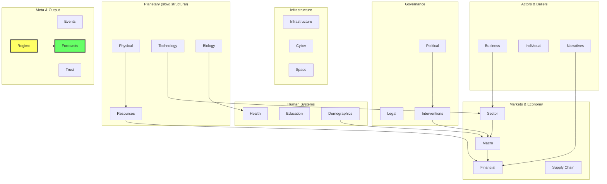

### Entity connection topology

The block diagram above shows layer-to-layer causal arrows. The bubble diagrams below show how **entity instances** connect through **coarse-grained (CG) bridge nodes**. When the schema is compiled onto the canvas, `compile_schema` creates a CG aggregate at each nesting level — a single canvas position that summarizes all fields below it. CG nodes (hexagons below) serve as information bottlenecks, enabling efficient cross-entity and cross-layer attention without O(n^2) all-to-all connections.

#### Full world instance map

All 25 top-level `World` fields. Dense always-on layers appear as circles. Entity instances appear as hexagons — each hexagon is that entity's coarse-grained bridge node, summarizing its entire internal state into a single canvas position that connects to the rest of the world.

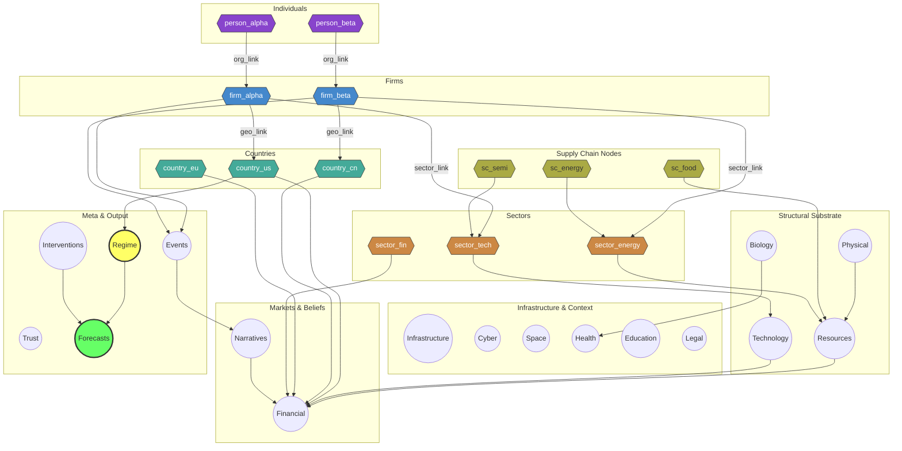

#### Cross-entity bridge chain

Entities form a hierarchy through explicit link fields (`org_link`, `sector_link`, `geography_link`). Each entity type's internal sub-components (circles) flow into that entity's CG bridge node (hexagon). Thick arrows show inter-entity bridges; dotted arrows show outward connections to dense layers.

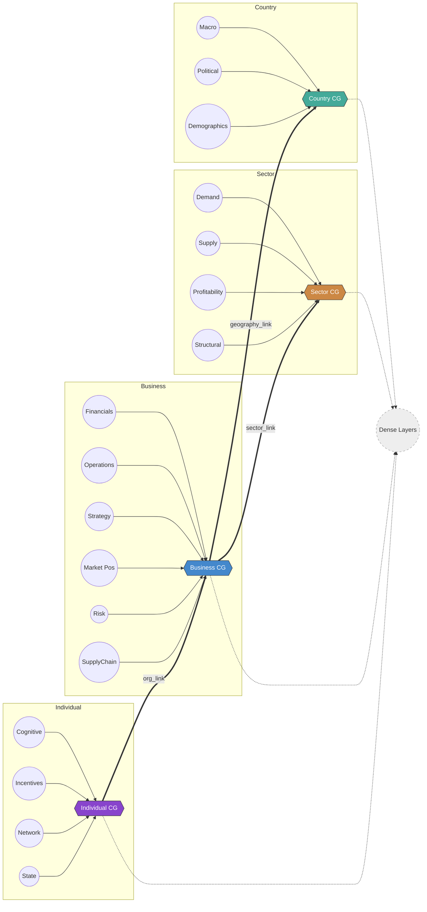

#### Country coarse-graining detail

A Country entity contains three major sub-schemas, each with its own CG bridge. Sub-component CG nodes (inner hexagons) aggregate their fields, then flow into the top-level Country CG (outer hexagon) that bridges to dense layers and other entities.

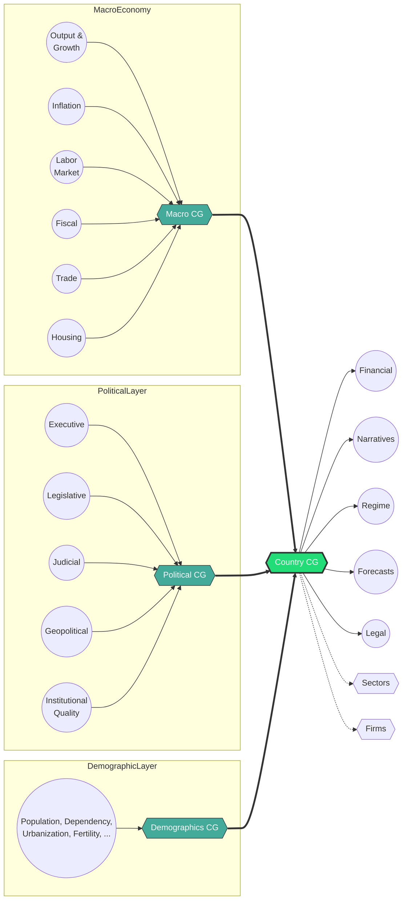

#### Business coarse-graining detail

A Business entity has six sub-schemas (including an embedded SupplyChainNode). Each flows through the Business CG bridge, which connects outward via `sector_link` and `geography_link` to Sector and Country entities, and directly to Financial, Events, and Forecasts layers.

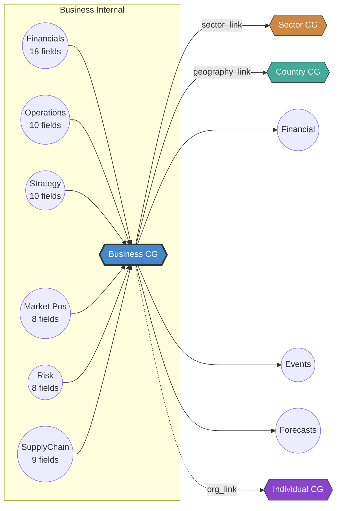

---

## 1. Planetary Physical Layer

**Frequency**: τ6–τ7 (annual to multi-year) · **Fields**: 17

Climate, geography, and natural disasters — the slowest structural forces that constrain everything above them. An earthquake disrupts supply chains. A shifting monsoon pattern moves food prices. These are boundary conditions on civilization.

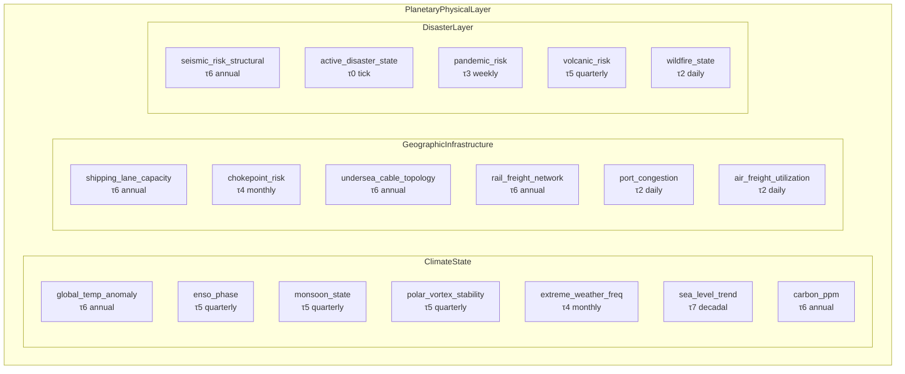

**Why this decomposition?** Climate operates on its own timescale but constrains resources (crop yields, energy demand). Geographic infrastructure — shipping lanes, cables, rail networks — changes slowly but creates chokepoints that matter in crises. Disasters are rare high-impact events that propagate through every other layer.

---

## 2. Resource Layer

**Frequency**: τ1–τ4 (hourly to monthly) · **Fields**: 45

Physical inputs to production: energy, metals, food, water, and compute. These are the atoms of the economy — priced in real-time, constrained by geology, and shaped by geopolitics.

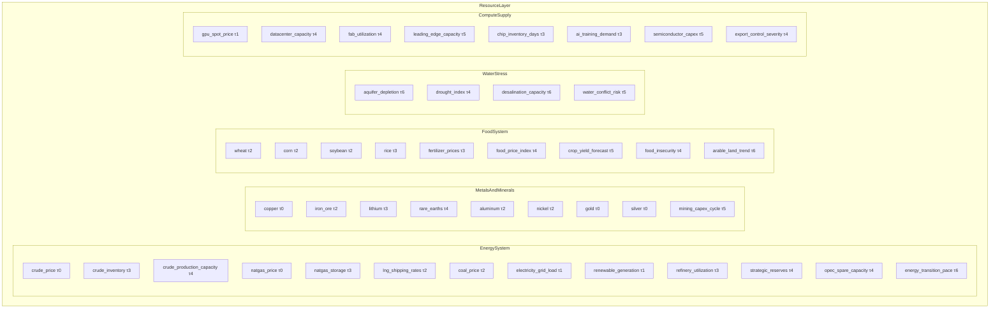

**Why this decomposition?** Energy prices (tick-level) sit atop slower inventory and capacity cycles (weekly/monthly). Metals and food are priced separately but share supply chain dependencies. Water stress is a slow-burn structural risk that shows up in food and energy costs. Compute supply is the 21st-century equivalent of electricity — a resource with its own pricing, capacity constraints, and geopolitical dimensions (export controls).

---

## 3. Global Financial Layer

**Frequency**: τ0–τ2 (sub-minute to daily) · **Fields**: 68

The fastest-moving layer. Yield curves, credit spreads, FX, equities, liquidity, and crypto — all interconnected through arbitrage and reflexivity.

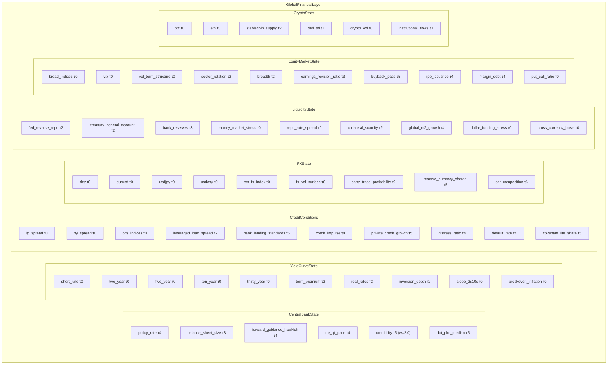

**Why this decomposition?** Markets are the world's real-time information system. The yield curve integrates growth expectations, inflation forecasts, and risk premia into a single object. Credit conditions propagate through the real economy with a lag. FX reflects relative monetary policy and capital flows. Liquidity is the plumbing — when it breaks (repo crisis, dollar squeeze), everything else breaks. Equities and crypto are the most reflexive, sentiment-driven markets. Each sub-system has its own frequency: yield levels are tick-level, but credit impulse is monthly.

---

## 4. Macroeconomic Layer

**Frequency**: τ3–τ5 (weekly to quarterly) · **Fields**: 67 (per country)

The real economy: GDP, inflation, labor, fiscal position, trade, and housing. This is instantiated per country — each `Country` entity contains a full `MacroEconomy`.

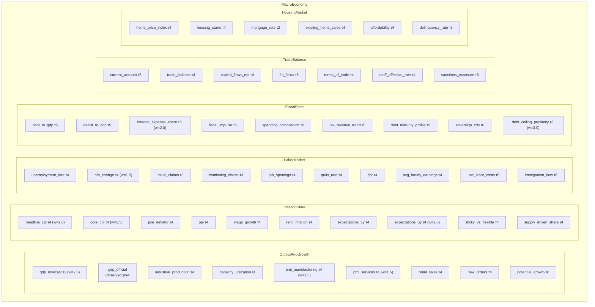

**Why this decomposition?** GDP is a lagging composite, so we track high-frequency nowcasts alongside official releases (with revision risk). Inflation is decomposed into components because the policy response depends on *which* prices are rising — rent vs food vs energy. Labor markets lead the cycle (claims are weekly). Fiscal position matters increasingly in a post-2020 world of large deficits. Trade and housing are transmission channels for monetary policy. Every field has a natural publication cadence built into its period.

---

## 5. Political Layer

**Frequency**: τ4–τ7 (monthly to multi-year) · **Fields**: 42 (per country)

Governance structures: executive power, legislative capacity, judicial independence, geopolitical dynamics, and institutional quality. These determine the rules of the game.

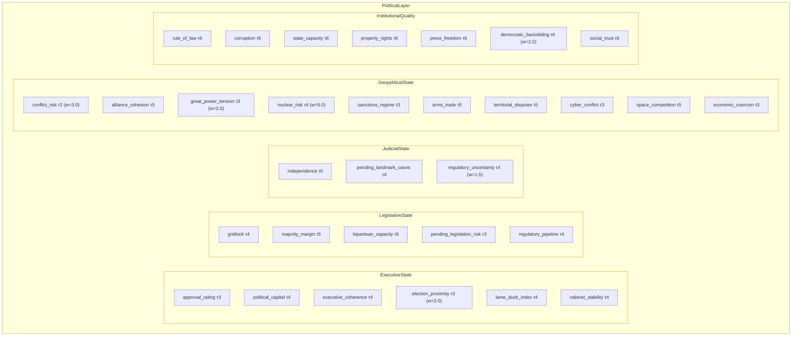

**Why this decomposition?** Markets react to political events (elections, policy announcements) but the *structural* political variables — institutional quality, rule of law — are the slow-moving foundations. Geopolitical state gets high loss weights because conflicts have outsized impact on all other layers. Nuclear risk at w=5.0 is the most heavily weighted political field: low probability, civilization-scale consequence.

---

## 6. Narrative & Belief Layer

**Frequency**: τ0–τ4 (sub-minute to monthly) · **Fields**: 35

Reflexivity in the world model. Media narratives, elite consensus, public sentiment, and investor positioning — beliefs that change reality by changing behavior.

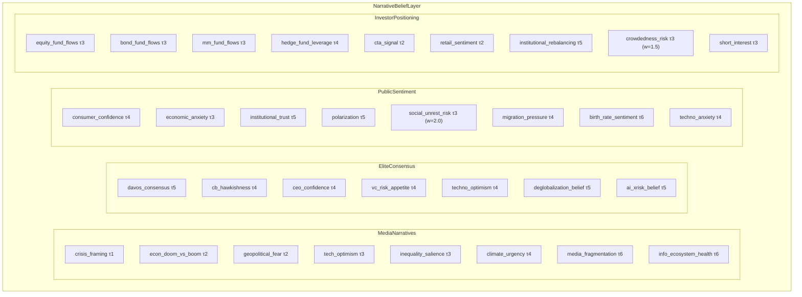

**Why this decomposition?** Soros's reflexivity: market participants' beliefs change the fundamentals. Media narratives frame the interpretation of data releases (the same jobs report reads differently under "doom" vs "boom" framing). Elite consensus (Davos, central bankers, VCs) sets investment and policy direction. Public sentiment drives consumption and political outcomes. Investor positioning is the mechanical bridge — fund flows *are* prices, and crowded trades create fragility.

---

## 7. Technology Layer

**Frequency**: τ5–τ7 (quarterly to multi-year) · **Fields**: 13

Long-run structural drivers. AI capability, biotech, quantum computing, and productivity — the forces that reshape the production function.

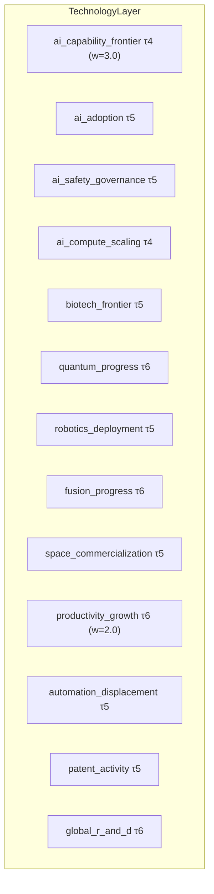

**Why this decomposition?** Technology operates on longer timescales than markets but occasionally creates discontinuities (GPT-4, mRNA vaccines). AI gets the most fields and highest weights because it's the meta-technology — it accelerates every other field. Productivity growth is the single most important long-run economic variable. The layer is deliberately sparse because technology is hard to forecast; the model should learn what it can and be honest about epistemic limits.

---

## 8. Biological Layer

**Frequency**: τ3–τ6 (weekly to annual) · **Fields**: 16

Ecological systems: biodiversity, disease dynamics, agricultural biology. The living substrate that human systems depend on.

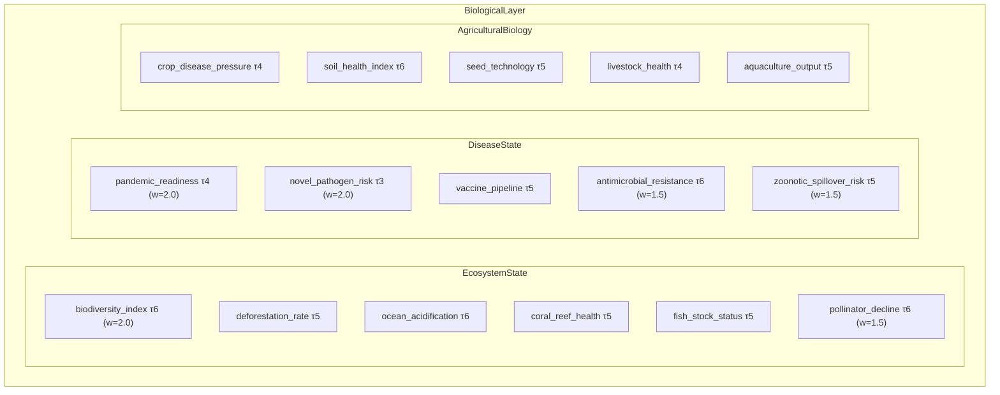

**Why this decomposition?** COVID demonstrated that biological systems can suddenly dominate all other layers. Ecosystem collapse (biodiversity, pollinators) is a slow-burn risk with catastrophic tail outcomes. Disease state tracks pandemic readiness and emerging threats. Agricultural biology feeds into food system prices and food security. Each sub-system has elevated loss weights because biological risks are systematically underpriced by markets.

---

## 9. Infrastructure Layer

**Frequency**: τ1–τ6 (hourly to annual) · **Fields**: 27

Power grids, transport networks, telecoms, urban systems. The physical substrate of the economy — usually invisible until it breaks.

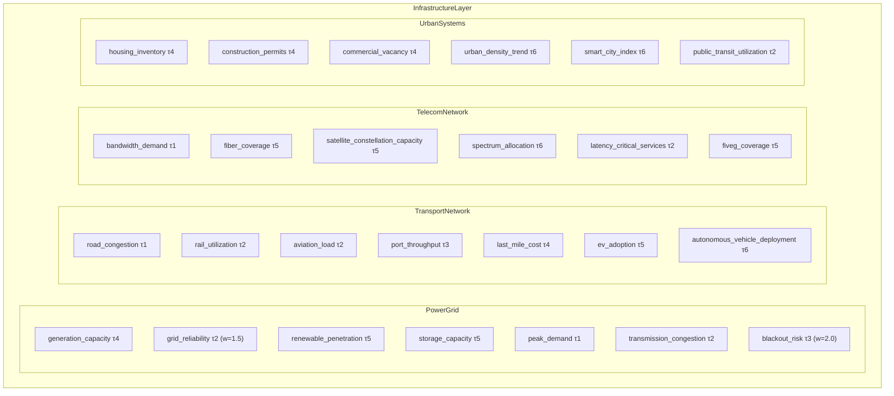

**Why this decomposition?** Infrastructure has the widest frequency spread: peak demand is hourly, but generation capacity changes monthly and renewable penetration is quarterly. Transport and telecom are separate because their failure modes are different. Urban systems connect to housing markets and demographics. Blackout risk gets elevated loss weight because grid failures cascade into every other system.

---

## 10. Cyber Layer

**Frequency**: τ2–τ5 (daily to quarterly) · **Fields**: 11

Cybersecurity threats and the digital ecosystem. A growing attack surface that increasingly affects physical infrastructure, financial systems, and geopolitics.

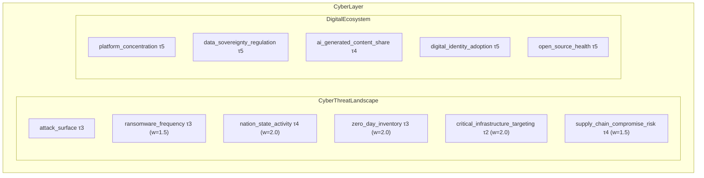

**Why this decomposition?** Cyber threats are one of the few domains where the attack surface grows faster than defenses. Nation-state activity and zero-day inventory track the offensive capability landscape. Critical infrastructure targeting bridges cyber to physical systems. The digital ecosystem fields track structural features of the internet itself — platform concentration, data sovereignty — that shape what kinds of attacks are possible.

---

## 11. Space Layer

**Frequency**: τ3–τ6 (weekly to annual) · **Fields**: 9

The orbital environment and space economy. Increasingly relevant as satellite internet, space tourism, and orbital congestion become economic factors.

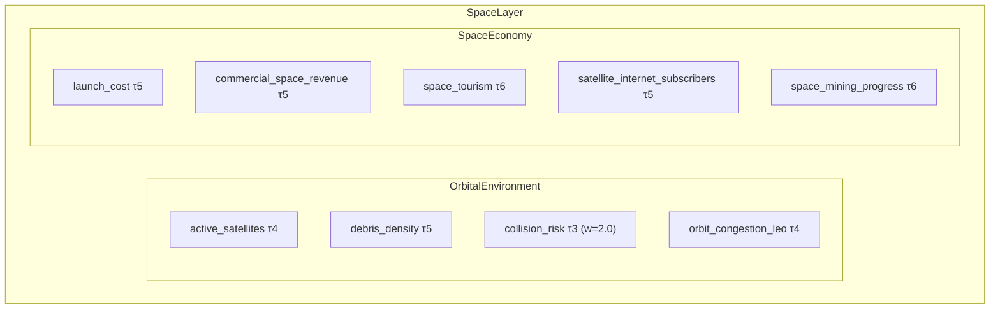

**Why this decomposition?** Kessler syndrome (collision cascading) is a low-probability, high-consequence risk to communications, GPS, and military systems. Launch cost tracks the SpaceX-driven deflation curve. Satellite internet is already affecting telecom markets. The layer is small but connects to infrastructure, cyber, and geopolitics.

---

## 12. Health Layer

**Frequency**: τ3–τ6 (weekly to annual) · **Fields**: 10

Healthcare capacity and public health outcomes. Connects to demographics, labor markets, and fiscal spending.

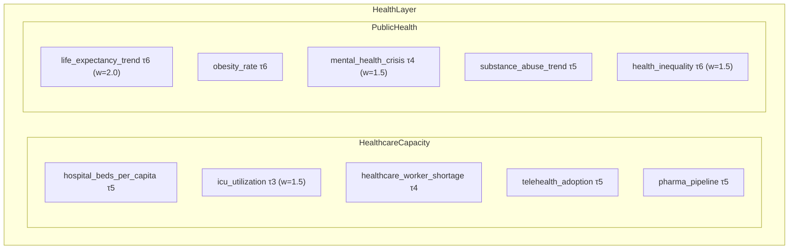

**Why this decomposition?** COVID revealed that healthcare capacity is a binding constraint on economic activity. ICU utilization is the canary — when it spikes, policy responses follow. Mental health crisis and substance abuse are slow-burn risks that show up in labor force participation and productivity. Health inequality connects to political polarization and social trust.

---

## 13. Education Layer

**Frequency**: τ4–τ6 (monthly to annual) · **Fields**: 11

Education systems and workforce development. The pipeline that turns demographics into human capital.

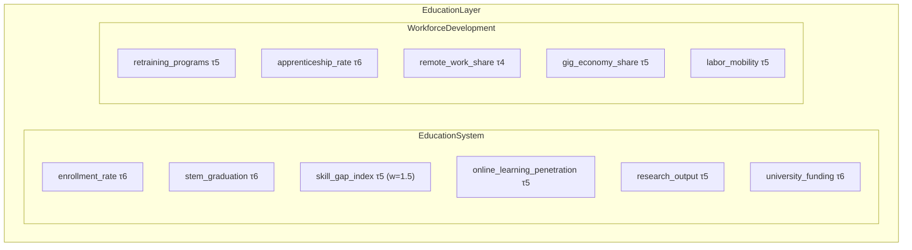

**Why this decomposition?** Skill gaps are the binding constraint on technology adoption. STEM graduation rates constrain AI development. Remote work share reshapes commercial real estate and urban systems. These fields operate on long timescales but have compounding effects.

---

## 14. Demographics Layer

**Frequency**: τ7 (decadal) · **Fields**: 10

The slowest structural force: population, dependency ratios, urbanization, fertility. These are the tectonic plates of economics.

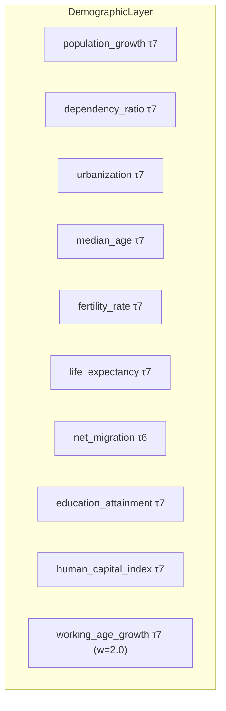

**Why this decomposition?** Demographics is destiny — but slowly. Working-age population growth determines potential GDP growth decades in advance. Dependency ratios drive fiscal pressure. Migration is the one fast-moving demographic variable (annual vs decadal). The layer is per-country, embedded inside `Country`.

---

## 15. Legal & Regulatory Layer

**Frequency**: τ5–τ6 (quarterly to annual) · **Fields**: 11

The regulatory environment and rule of law. These fields determine the cost of doing business and the reliability of contracts.

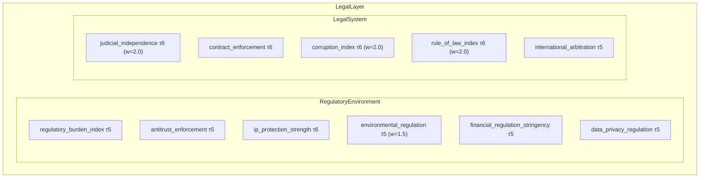

**Why this decomposition?** Regulatory environment changes at quarterly cadence (new rules, enforcement actions) while the underlying legal system quality is annual/structural. High loss weights on rule of law and corruption because these are among the strongest predictors of long-run economic outcomes.

---

## 16. Sector Layer

**Frequency**: τ3–τ5 (weekly to quarterly) · **Fields**: 19 (per sector)

Per-GICS sector dynamics: demand, supply, profitability, and structural forces. Instantiated dynamically for requested sectors.

```mermaid
graph TD
    subgraph Sector
        subgraph Demand
            SD1[demand_growth τ4]
            SD2[pricing_power τ4]
            SD3[order_backlog τ4]
            SD4[end_market_health τ4]
        end
        subgraph Supply
            SS1[capacity_utilization τ4]
            SS2[supply_chain_stress τ3]
            SS3[inventory_to_sales τ4]
            SS4[labor_availability τ4]
        end
        subgraph Profitability
            SP1[margins τ5]
            SP2[input_cost_pressure τ4]
            SP3[revenue_growth τ5]
            SP4[capex_cycle τ5]
        end
        subgraph Structural
            ST1[innovation_rate τ5]
            ST2["regulatory_risk τ4 (w=1.5)"]
            ST3["disruption_risk τ5 (w=2.0)"]
            ST4[esg_pressure τ5]
            ST5[m_and_a_activity τ5]
            ST6[concentration τ6]
        end
        DQ[data_quality τ5]
    end
```

**Why this decomposition?** Sectors are the natural unit of equity analysis. Demand/supply/profitability captures the operating leverage cycle. Structural fields (disruption risk, concentration) drive long-run sector returns. Each sector is a dynamic entity — add `entities={"sector_tech": Sector(), "sector_energy": Sector()}` to include sector-level analysis in a projection.

---

## 17. Supply Chain Layer

**Frequency**: τ2–τ4 (daily to monthly) · **Fields**: 9 (per node)

Graph structure: each supply chain node has concentration, inventory, lead time, and fragility metrics. These form a network that propagates shocks.

```mermaid
graph TD
    subgraph SupplyChainNode
        SC1[upstream_concentration τ4]
        SC2[downstream_concentration τ4]
        SC3[inventory τ3]
        SC4[lead_time τ3]
        SC5[logistics_friction τ2]
        SC6["bottleneck_severity τ2 (w=2.0)"]
        SC7[substitutability τ5]
        SC8[geographic_risk τ4]
        SC9["single_point_of_failure τ5 (w=3.0)"]
    end
```

**Why this decomposition?** Supply chain disruptions (COVID, Suez Canal, semiconductor shortages) propagate non-linearly. The key insight is that *concentration* and *substitutability* determine fragility. Single point of failure gets the highest weight (w=3.0) because it identifies the nodes where disruption is catastrophic. The layer is embedded inside `Business` entities, creating a firm-level supply chain graph.

---

## 18. Business Layer

**Frequency**: τ2–τ5 (daily to quarterly) · **Fields**: 57 (per firm)

Full firm decomposition: financials, operations, strategy, market position, and risk. The richest dynamic entity in the schema.

```mermaid
graph TD
    subgraph Business
        subgraph FirmFinancials
            FF1[revenue τ5]
            FF2["revenue_growth τ5 (w=2.0)"]
            FF3[cogs τ5]
            FF4["gross_margin τ5 (w=2.0)"]
            FF5[opex τ5]
            FF6["operating_margin τ5 (w=2.0)"]
            FF7[net_income τ5]
            FF8["fcf τ5 (w=2.5)"]
            FF9[cash τ5]
            FF10[total_debt τ5]
            FF11["net_debt_to_ebitda τ5 (w=2.0)"]
            FF12["interest_coverage τ5 (w=2.0)"]
            FF13["covenant_headroom τ5 (w=3.0)"]
            FF14["maturity_wall τ5 (w=2.5)"]
            FF15[working_capital τ5]
            FF16[capex τ5]
            FF17[share_count τ5]
            FF18[insider_transactions τ4]
        end
        subgraph FirmOperations
            FO1[capacity τ4]
            FO2[utilization τ4]
            FO3[backlog τ4]
            FO4["pricing_power τ4 (w=1.5)"]
            FO5[customer_concentration τ5]
            FO6[supplier_concentration τ5]
            FO7[quality_incidents τ4]
            FO8[headcount τ5]
            FO9[employee_satisfaction τ5]
            FO10[tech_debt τ5]
        end
        subgraph FirmStrategy
            FS1[roadmap_clarity τ5]
            FS2[capex_plan τ5]
            FS3[m_and_a_appetite τ5]
            FS4[geographic_expansion τ5]
            FS5[product_pipeline τ5]
            FS6["moat_durability τ6 (w=2.0)"]
            FS7["management_quality τ5 (w=2.0)"]
            FS8["capital_allocation τ5 (w=2.0)"]
            FS9[governance_quality τ5]
            FS10[esg_posture τ5]
        end
        subgraph FirmMarketPosition
            FM1[equity_price τ0]
            FM2[implied_vol τ0]
            FM3[credit_spread τ0]
            FM4[analyst_consensus τ3]
            FM5[short_interest τ3]
            FM6[institutional_ownership τ5]
            FM7[pe_ratio τ2]
            FM8[ev_ebitda τ2]
        end
        subgraph FirmRisk
            FR1[regulatory_exposure τ4]
            FR2[litigation_risk τ4]
            FR3[cyber_vulnerability τ4]
            FR4["key_person_risk τ5 (w=2.0)"]
            FR5[supply_chain_fragility τ4]
            FR6["geopolitical_exposure τ4 (w=1.5)"]
            FR7[climate_transition_risk τ6]
            FR8["tech_obsolescence τ5 (w=2.0)"]
        end
        subgraph LatentAndOutputs
            LO1["latent_health (w=3.0)"]
            LO2["latent_momentum (w=2.0)"]
            LO3["latent_tail_risk (w=4.0)"]
            LO4["recommended_action (w=3.0)"]
            LO5["fair_value_estimate (w=2.0)"]
        end
    end
```

**Why this decomposition?** Business is where the macro-financial-political worlds meet the micro-reality of a single firm. The 57-field decomposition covers the full analyst toolkit: financial statements (income, balance sheet, cash flow), operational metrics (capacity, backlog, quality), strategic positioning (moat, management, M&A), market pricing (equity, credit, vol), and risk factors. Latent variables (health, momentum, tail_risk) are unobserved — the model learns to infer them from the observed fields. Each firm also embeds a `SupplyChainNode`, connecting the firm-level graph to the supply chain network.

---

## 19. Individual Layer

**Frequency**: τ2–τ5 (daily to quarterly) · **Fields**: 27 (per person)

Psychological decomposition of decision-makers: cognition, incentives, network position, and current state. The most speculative layer, designed for modeling CEOs, central bankers, and political leaders.

```mermaid
graph TD
    subgraph Individual
        subgraph PersonCognitive
            PC1[decision_style τ5]
            PC2[risk_appetite τ4]
            PC3[time_horizon τ5]
            PC4[belief_update_speed τ4]
            PC5[cognitive_load τ3]
            PC6[ideological_priors τ6]
        end
        subgraph PersonIncentives
            PI1[compensation_structure τ5]
            PI2[career_incentives τ5]
            PI3[reputation_concerns τ4]
            PI4[legal_exposure τ4]
            PI5[legacy_concerns τ5]
            PI6[peer_pressure τ4]
        end
        subgraph PersonNetwork
            PN1[formal_authority τ5]
            PN2[network_centrality τ5]
            PN3[trusted_advisors τ5]
            PN4[board_relationships τ5]
            PN5[political_connections τ5]
            PN6[media_influence τ4]
        end
        subgraph PersonState
            PS1[stress τ3]
            PS2[health_energy τ4]
            PS3[confidence τ3]
            PS4[current_focus τ3]
            PS5[public_statements_tone τ2]
            PS6["private_info_proxy τ3 (w=3.0)"]
        end
        subgraph OutputHeads
            OH1["projected_actions (w=3.0)"]
            OH2["action_timing (w=2.0)"]
            OH3["surprise_risk (w=4.0)"]
        end
    end
```

**Why this decomposition?** Individual decision-makers can move markets. A Fed chair's hawkishness, a CEO's risk appetite, a president's belligerence — these matter. The decomposition follows behavioral economics: cognitive style determines *how* information is processed; incentives determine *what* actions are likely; network position determines *influence*; current state determines *timing*. Private information proxy (w=3.0) is the holy grail — what does this person know that the market doesn't?

---

## Meta Layers

### Event Tape

**Frequency**: τ0–τ1 (real-time) · **Fields**: 10

Dense-in-time, compressed-in-space stream of world events.

```mermaid
graph TD
    subgraph EventTape
        EV1["news_embedding τ0 (4×8)"]
        EV2["social_signal τ0 (2×4)"]
        EV3["filing_events τ2 (2×4)"]
        EV4["earnings_call_signal τ5 (2×4)"]
        EV5["policy_announcement τ0 (w=2.0)"]
        EV6["conflict_event τ0 (w=3.0)"]
        EV7["disaster_event τ0 (w=2.0)"]
        EV8[trade_data_release τ4]
        EV9["central_bank_comms τ4 (w=2.0)"]
        EV10["election_event τ3 (w=2.0)"]
    end
```

### Data Channel Trust

**Frequency**: varies · **Fields**: 17

Meta-epistemic calibration: how much should the model trust each data source?

```mermaid
graph TD
    subgraph DataChannelTrust
        subgraph GovernmentStats
            GT1[trust_bls τ5]
            GT2[trust_census τ6]
            GT3[trust_fed τ5]
            GT4[trust_foreign_gov τ5]
        end
        subgraph MarketData
            MD1[trust_exchange τ4]
            MD2[trust_otc τ4]
            MD3[trust_credit_rating τ5]
        end
        subgraph AlternativeData
            AD1[trust_satellite τ5]
            AD2[trust_web_scraping τ4]
            AD3[trust_social_sentiment τ3]
            AD4[trust_survey τ4]
        end
        subgraph Corporate
            CD1[trust_gaap τ5]
            CD2["trust_mgmt_guidance τ5 (w=2.0)"]
            CD3["trust_non_gaap τ5 (w=1.5)"]
        end
        subgraph Meta
            ME1["overall_epistemic_state (w=2.0)"]
            ME2[information_advantage]
            ME3["adversarial_info_risk τ3 (w=2.0)"]
        end
    end
```

### Regime State

**Frequency**: τ5–τ7 (quarterly to decadal) · **Fields**: 17

The compressed world state. Regime variables determine which causal channels are active — in a recession regime, different dynamics dominate than in expansion.

```mermaid
graph TD
    subgraph RegimeState
        subgraph EconomicRegime
            ER1["growth_regime τ5 (w=5.0)"]
            ER2["inflation_regime τ5 (w=5.0)"]
            ER3["financial_cycle τ5 (w=4.0)"]
            ER4["credit_cycle τ5 (w=4.0)"]
            ER5["liquidity_regime τ4 (w=4.0)"]
        end
        subgraph GeopoliticalRegime
            GR1["cooperation_vs_fragmentation τ6 (w=4.0)"]
            GR2["peace_vs_conflict τ5 (w=5.0)"]
            GR3["hegemonic_stability τ7 (w=3.0)"]
            GR4["globalization_vs_autarky τ6 (w=3.0)"]
        end
        subgraph TechnologyRegime
            TR1["ai_acceleration τ5 (w=4.0)"]
            TR2["energy_transition_phase τ6 (w=3.0)"]
            TR3["productivity_regime τ6 (w=3.0)"]
        end
        subgraph SystemicRisk
            SR1["fragility τ4 (w=5.0)"]
            SR2["reflexivity_intensity τ4 (w=4.0)"]
            SR3["tail_risk_concentration τ4 (w=5.0)"]
            SR4["black_swan_proximity τ3 (w=5.0)"]
        end
        CS["compressed_world_state (4×8, w=3.0)"]
    end
```

### Intervention Space

**Frequency**: varies · **Fields**: 13

What-if analysis: declare a policy intervention, predict the counterfactual effects.

```mermaid
graph TD
    subgraph InterventionSpace
        subgraph PolicyInterventions
            PI1[monetary_policy_change τ4]
            PI2[fiscal_policy_change τ5]
            PI3[regulatory_action τ4]
            PI4[sanctions_change τ3]
            PI5[trade_policy_change τ4]
            PI6["military_action τ3 (w=5.0)"]
            PI7[firm_strategic_action τ5]
            PI8[technology_release τ4]
            PI9[market_intervention τ3]
        end
        subgraph CounterfactualHeads
            CF1["effect_3m (w=3.0)"]
            CF2["effect_12m (w=2.0)"]
            CF3["second_order_effects (w=2.0)"]
            CF4["unintended_consequences (w=3.0)"]
        end
    end
```

### Forecast Bundle

**Frequency**: output heads · **Fields**: 32

Structured output predictions: recession probability, credit stress, conflict escalation, and more.

```mermaid
graph TD
    subgraph ForecastBundle
        subgraph MacroForecast
            MF1["recession_prob_3m (w=5.0)"]
            MF2["recession_prob_12m (w=4.0)"]
            MF3["gdp_growth_3m (w=3.0)"]
            MF4["gdp_growth_12m (w=2.0)"]
            MF5["inflation_path_12m (w=3.0)"]
            MF6["rates_path_12m (w=3.0)"]
            MF7["unemployment_path_12m (w=2.0)"]
        end
        subgraph FinancialForecast
            FF1["credit_stress_3m (w=4.0)"]
            FF2["equity_regime_3m (w=3.0)"]
            FF3["vol_regime_3m (w=3.0)"]
            FF4["sector_rotation_3m (w=2.0)"]
            FF5["curve_shape_3m (w=2.0)"]
            FF6["fx_regime_3m (w=2.0)"]
            FF7["liquidity_crisis_prob (w=5.0)"]
        end
        subgraph GeopoliticalForecast
            GF1["conflict_escalation_3m (w=5.0)"]
            GF2["sanctions_change_3m (w=3.0)"]
            GF3["alliance_shift_12m (w=2.0)"]
            GF4["regime_change_prob (w=4.0)"]
            GF5["election_outcome (w=3.0)"]
        end
        subgraph BusinessForecast
            BF1["revenue_surprise (w=3.0)"]
            BF2["margin_trajectory (w=3.0)"]
            BF3["default_prob_12m (w=5.0)"]
            BF4["strategic_pivot_prob (w=3.0)"]
            BF5["m_and_a_prob (w=2.0)"]
            BF6["mgmt_change_prob (w=3.0)"]
        end
        subgraph UncertaintyDecomposition
            UD1["aleatoric_macro (w=2.0)"]
            UD2["aleatoric_geopolitical (w=2.0)"]
            UD3["epistemic_data_gaps (w=2.0)"]
            UD4[epistemic_model_limits]
            UD5["scenario_divergence (w=3.0)"]
            UD6["calibration_score (w=3.0)"]
        end
    end
```

---

## Summary statistics

| Layer | Fields | Frequency range | Dynamic? |
|-------|--------|----------------|----------|
| Physical | 17 | τ0–τ7 | No |
| Resources | 45 | τ0–τ6 | No |
| Financial | 68 | τ0–τ5 | No |
| Macro | 67 | τ0–τ6 | Per country |
| Political | 42 | τ2–τ6 | Per country |
| Narratives | 35 | τ1–τ6 | No |
| Technology | 13 | τ4–τ6 | No |
| Biology | 16 | τ3–τ6 | No |
| Infrastructure | 27 | τ1–τ6 | No |
| Cyber | 11 | τ2–τ5 | No |
| Space | 9 | τ3–τ6 | No |
| Health | 10 | τ3–τ6 | No |
| Education | 11 | τ4–τ6 | No |
| Demographics | 10 | τ6–τ7 | Per country |
| Legal | 11 | τ5–τ6 | No |
| Sector | 19 | τ3–τ6 | Per sector |
| Supply Chain | 9 | τ2–τ5 | Per node |
| Business | 57 | τ0–τ6 | Per firm |
| Individual | 27 | τ2–τ6 | Per person |
| Events | 10 | τ0–τ5 | No |
| Trust | 17 | τ3–τ6 | No |
| Regime | 17 | τ3–τ7 | No |
| Interventions | 13 | τ3–τ5 | No |
| Forecasts | 32 | output | No |
| **Total** | **857** | **τ0–τ7** | |

**Temporal frequency classes:**

| Class | Period (ticks) | Real-world cadence | Description |
|-------|----------------|-------------------|-------------|
| τ0 | 1 | Sub-minute | Market prices, breaking news |
| τ1 | 4 | Hourly | Grid load, intraday commodities |
| τ2 | 16 | Daily | Commodity closes, port congestion |
| τ3 | 48 | Weekly | Jobless claims, inventories |
| τ4 | 192 | Monthly | CPI, PMI, housing starts |
| τ5 | 576 | Quarterly | GDP, earnings, capex |
| τ6 | 2304 | Annual | Demographics, infrastructure |
| τ7 | 4608 | Multi-year | Regime changes, tech diffusion |
