# Use Cases

The General Unified World Model is designed for anyone who needs to reason about how the world works -- from hedge fund PMs to government analysts to AI agents. Each use case involves projecting to the relevant subset of fields, training on available data, and querying predictions.

---

## Macro-Financial Risk Analysis

**Who**: Hedge fund PM, risk analyst, macro strategist

A hedge fund PM needs to understand recession risk, rate paths, and equity exposure given current macro conditions.

<figure markdown>
  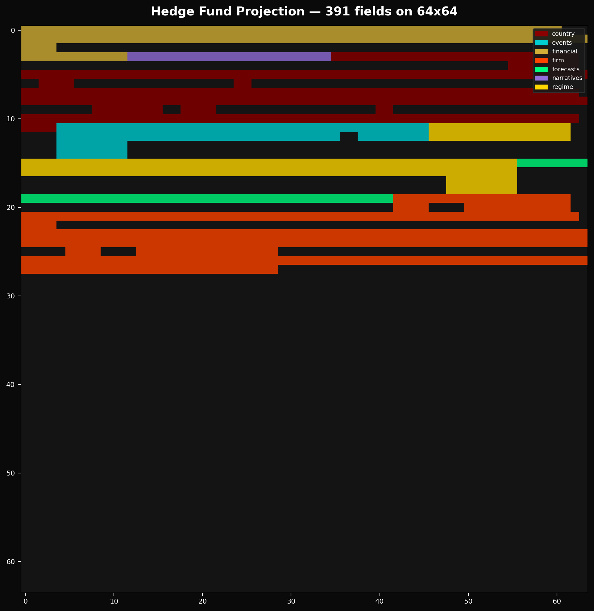{ loading=lazy }
  <figcaption>Hedge fund projection — financial, macro, regime, and firm fields packed onto a 64x64 canvas. Source: <a href="https://github.com/JacobFV/general-unified-world-modeling/blob/develop/scripts/generate_assets.py">generate_assets.py</a></figcaption>
</figure>

```python
from general_unified_world_model import World, project
from general_unified_world_model.schema.business import Business

bound = project(
    World(),
    include=[
        "financial",               # yields, credit, FX, equities, crypto
        "country_us.macro",        # GDP, inflation, labor, housing
        "regime",                  # growth/crisis/transition mode
        "forecasts.macro",         # recession probability
        "forecasts.financial",     # credit stress, rate path
    ],
    entities={
        "firm_AAPL": Business(),
        "firm_NVDA": Business(),
        "firm_JPM": Business(),
    },
    d_model=64,
)
```

<figure markdown>
  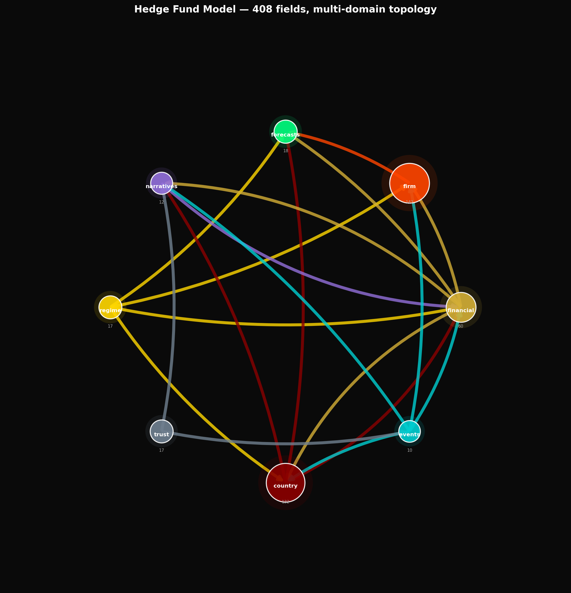{ loading=lazy }
  <figcaption>Multi-domain topology: how financial, macro, regime, narrative, and firm domains connect. Each edge is an attention connection in the transformer.</figcaption>
</figure>

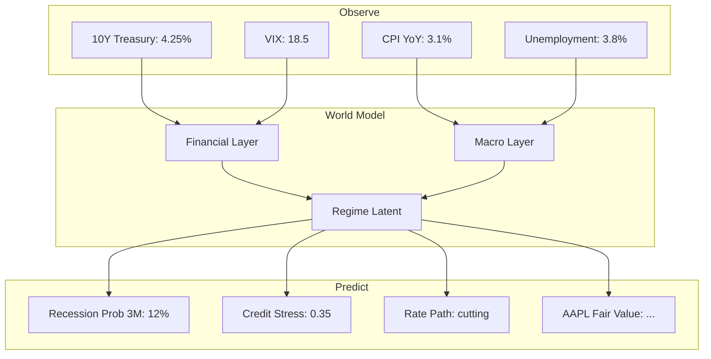

**Data sources**: FRED (39 macro series), Yahoo Finance (equities, FX, commodities, crypto), earnings data for tracked firms.

**What the model learns**: How inflation expectations propagate through the yield curve. How labor market tightness affects Fed policy. How equity risk premia respond to credit conditions. All through shared latent structure -- no hand-coded rules.

<figure markdown>
  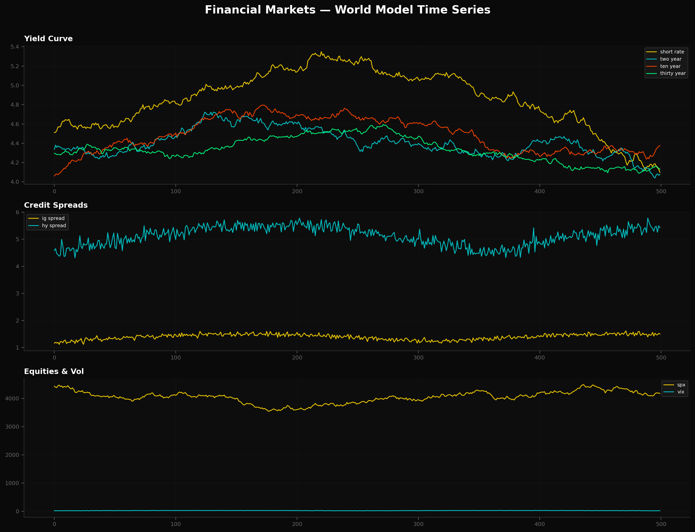{ loading=lazy }
  <figcaption>Financial layer time series: yields, credit spreads, FX, equities, and volatility. Mock data visualization — trained model predictions coming soon.</figcaption>
</figure>

[:octicons-code-16: Source: examples/05_train_financial.py](https://github.com/JacobFV/general-unified-world-modeling/blob/develop/examples/05_train_financial.py){ .md-button }

---

## Geopolitical Risk & Commodity Exposure

**Who**: Commodities trader, geopolitical analyst, defense strategist

A commodities trader needs to understand how geopolitical tensions affect energy and metals prices.

<figure markdown>
  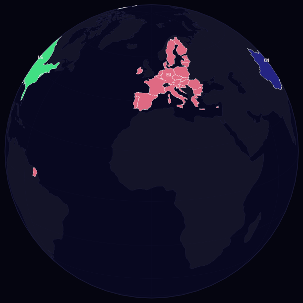{ loading=lazy }
  <figcaption>Rotating globe: each nation's color encodes a compressed vector of political stability, conflict risk, and economic alignment. Generated from mock data — trained predictions coming soon.</figcaption>
</figure>

```python
from general_unified_world_model import World, project
from general_unified_world_model.schema.country import Country

bound = project(
    World(),
    include=[
        "resources",                    # energy, metals, agriculture
        "country_us.politics",          # US policy stance
        "country_cn.politics",          # China policy stance
        "events",                       # news and policy events
        "regime",                       # global regime state
        "forecasts.geopolitical",       # conflict risk
    ],
    entities={
        "country_ru": Country(),        # Russia
        "country_sa": Country(),        # Saudi Arabia
    },
    d_model=64,
)
```

<figure markdown>
  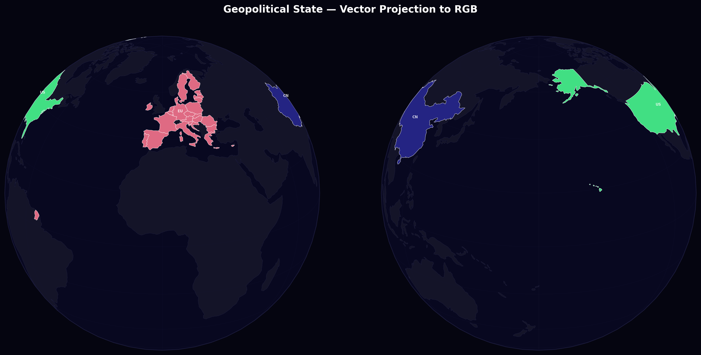{ loading=lazy }
  <figcaption>Dual-hemisphere geopolitical state. Vector-to-RGB projection of the full political layer — conflict risk, alliance cohesion, institutional quality.</figcaption>
</figure>

**Data sources**: Yahoo Finance commodities (CL=F, NG=F, GC=F, SI=F, HG=F), ACLED/UCDP conflict data, GDELT news events.

**What the model learns**: How sanctions on Russia affect European natural gas. How OPEC+ decisions propagate to copper demand expectations. How conflict risk feeds into gold positioning.

!!! note "Coming soon: live conflict prediction"
    Real-time geopolitical event prediction from news embeddings. The rotating globe will update with model predictions as events unfold.

---

## Corporate Strategy & Competitive Intelligence

**Who**: CEO, CFO, board advisor, strategy consultant

A CEO needs to understand how macro conditions and competitor moves affect their strategic position.

<figure markdown>
  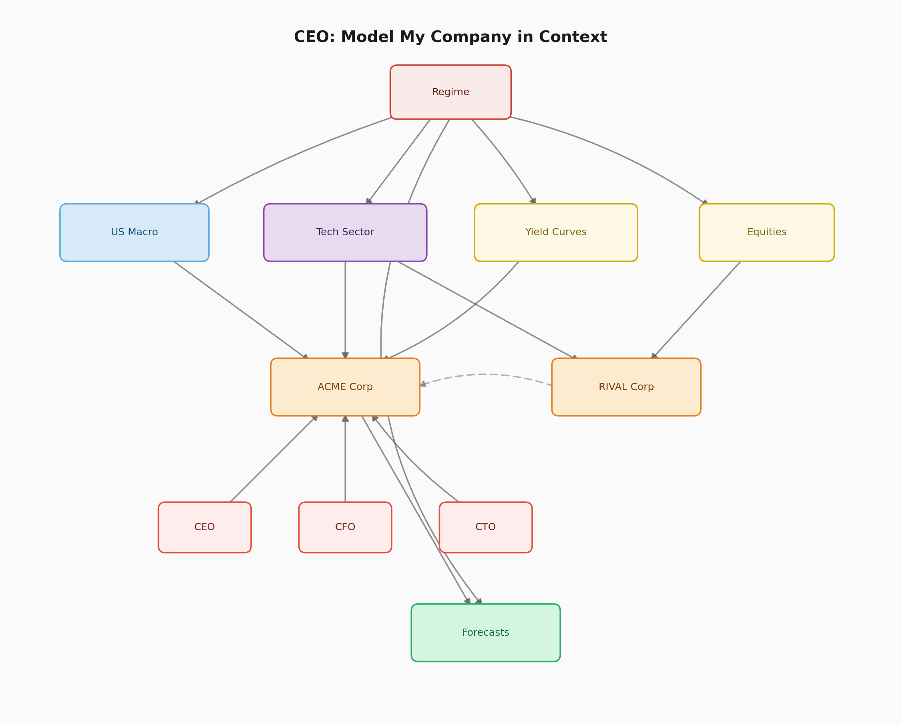{ loading=lazy }
  <figcaption>CEO perspective: causal interaction graph showing how macro, sector, competitive, and individual factors interact. Source: <a href="https://github.com/JacobFV/general-unified-world-modeling/blob/develop/examples/02_ceo_company_model.py">02_ceo_company_model.py</a></figcaption>
</figure>

```python
from general_unified_world_model import World, project
from general_unified_world_model.schema.business import Business
from general_unified_world_model.schema.individual import Individual

bound = project(
    World(),
    include=[
        "financial.equities",
        "country_us.macro",
        "regime",
        "forecasts.business",
        "narratives.elites",
    ],
    entities={
        "firm_ACME": Business(),
        "firm_RIVAL": Business(),
        "person_ceo": Individual(),
        "person_cfo": Individual(),
        "person_board_chair": Individual(),
    },
    d_model=64,
)
```

<figure markdown>
  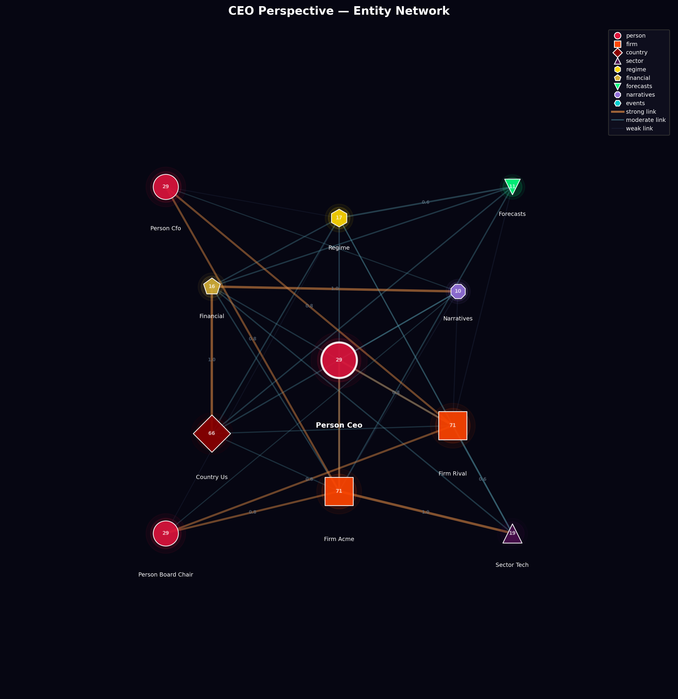{ loading=lazy }
  <figcaption>Entity network from the CEO's perspective: firms, individuals, sectors, and their attention connections. The topology defines which entities can attend to which.</figcaption>
</figure>

**Data sources**: Yahoo Finance equity prices, quarterly earnings (revenue, margins, R&D spend), FRED macro context.

**What the model learns**: How macro conditions drive consumer spending (and therefore AAPL revenue). How NVDA's data center demand correlates with Fed policy (cheap money -> tech capex). How competitive dynamics between firms create correlated risks.

[:octicons-code-16: Source: examples/02_ceo_company_model.py](https://github.com/JacobFV/general-unified-world-modeling/blob/develop/examples/02_ceo_company_model.py){ .md-button }

---

## Government Policy Impact Analysis

**Who**: Central bank economist, Treasury analyst, policy advisor

A central bank economist needs to understand how monetary policy transmits through the economy.

<figure markdown>
  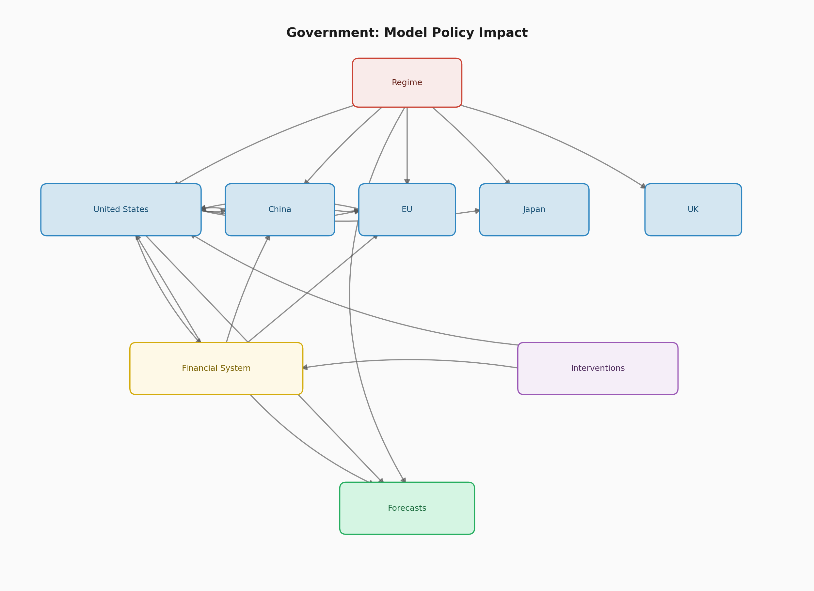{ loading=lazy }
  <figcaption>Policy transmission mechanism: from Fed Funds Rate through yield curve, credit conditions, housing, and labor to GDP/inflation outcomes. Source: <a href="https://github.com/JacobFV/general-unified-world-modeling/blob/develop/examples/03_government_policy.py">03_government_policy.py</a></figcaption>
</figure>

```python
from general_unified_world_model import World, project
from general_unified_world_model.schema.country import Country

bound = project(
    World(),
    include=[
        "country_us",               # full US: macro + politics
        "financial",                 # markets respond to policy
        "interventions",             # monetary + fiscal tools
        "regime",
        "forecasts",
    ],
    entities={
        "country_cn_extra": Country(),
        "country_eu_extra": Country(),
        "country_jp": Country(),
        "country_uk": Country(),
    },
    d_model=128,
)
```

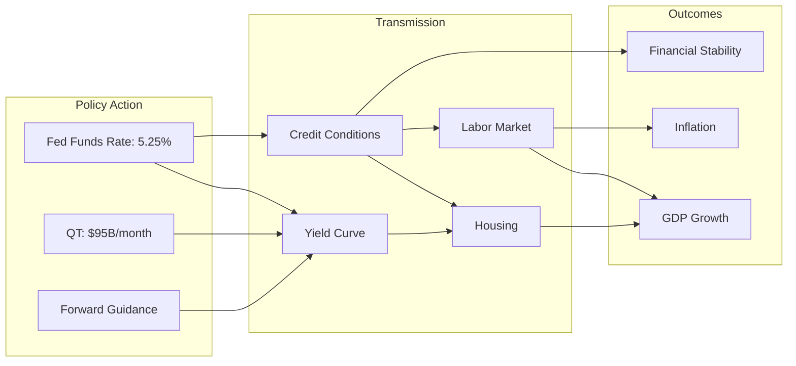

**Data sources**: FRED (50+ series covering yields, credit, labor, housing, sentiment), IMF WEO forecasts, BIS cross-border statistics.

**What the model learns**: The full transmission mechanism from policy rate changes through the yield curve, credit conditions, housing, and labor markets to GDP and inflation outcomes. Cross-country spillovers from US monetary policy to emerging markets.

[:octicons-code-16: Source: examples/03_government_policy.py](https://github.com/JacobFV/general-unified-world-modeling/blob/develop/examples/03_government_policy.py){ .md-button }

---

## AI Agent World Context

**Who**: AI agent developers, autonomous system designers

An AI agent operating in the real world needs a compressed understanding of "what's happening" to make better decisions.

<figure markdown>
  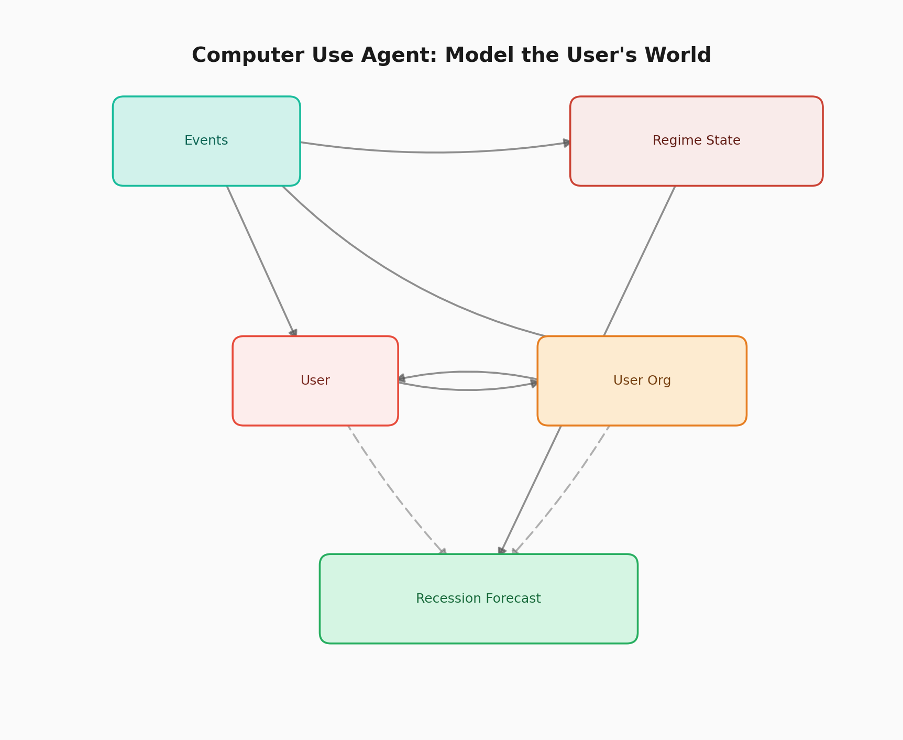{ loading=lazy }
  <figcaption>Agent context graph: user psychology, world events, regime state, and technology frontier feed into agent decision-making. Source: <a href="https://github.com/JacobFV/general-unified-world-modeling/blob/develop/examples/04_computer_use_agent.py">04_computer_use_agent.py</a></figcaption>
</figure>

```python
from general_unified_world_model import GeneralUnifiedWorldModel

model = GeneralUnifiedWorldModel(
    include=[
        "narratives",          # what people are saying
        "events",              # what just happened
        "regime",              # world mode
        "technology",          # tech frontier
        "forecasts",           # where things are heading
    ],
    d_model=64,
)

# The agent queries the world model as context
model.observe("events.news_embedding", latest_news_embedding)
context = model.predict()
# context["regime.growth_regime"] -> "expansion"
# context["forecasts.macro.recession_prob_3m"] -> 0.08
```

**What the model provides**: A structured, calibrated summary of world state that an agent can use for decision-making. Instead of raw news feeds, the agent gets a compressed latent that captures cross-domain dynamics.

[:octicons-code-16: Source: examples/04_computer_use_agent.py](https://github.com/JacobFV/general-unified-world-modeling/blob/develop/examples/04_computer_use_agent.py){ .md-button }

---

## Custom Dataset Integration

Any dataset can be integrated by declaring `InputSpec` and `OutputSpec` mappings:

```python
from general_unified_world_model import DatasetSpec, InputSpec, OutputSpec

# Map your private data to world model fields
my_spec = DatasetSpec(
    name="Internal Risk Model",
    input_specs=[
        InputSpec(
            key="credit_score",
            semantic_type="Corporate credit risk score",
            field_path="financial.credit.ig_spread",
        ),
        InputSpec(
            key="revenue_forecast",
            semantic_type="Quarterly revenue forecast",
            field_path="firm_ACME.financials.revenue",
        ),
    ],
    output_specs=[
        OutputSpec(
            key="default_prob",
            semantic_type="Default probability",
            field_path="forecasts.financial.credit_stress",
        ),
    ],
)
```

The LLM-powered annotator can also do this automatically:

```python
from general_unified_world_model.llm.dataset_annotator import annotate_dataset

spec = annotate_dataset(
    name="my_data",
    columns=["revenue", "eps", "guidance", "sector"],
    sample_values={"revenue": [42.5, 43.1, 44.8], "eps": [1.23, 1.31, 1.42]},
    description="Quarterly earnings data for tech companies",
)
```

[:octicons-code-16: Source: examples/05_train_financial.py](https://github.com/JacobFV/general-unified-world-modeling/blob/develop/examples/05_train_financial.py){ .md-button }

---

## More use cases coming soon

!!! info "Planned examples"
    - **Healthcare system modeling**: Patient outcomes, hospital capacity, pharmaceutical pipeline
    - **Climate & energy transition**: Renewable adoption, carbon pricing, grid reliability
    - **Supply chain resilience**: Semiconductor supply, logistics bottleneck detection
    - **Election forecasting**: Polling, economic indicators, social sentiment → electoral outcomes
    - **Pandemic early warning**: Novel pathogen risk, healthcare capacity, travel restrictions
